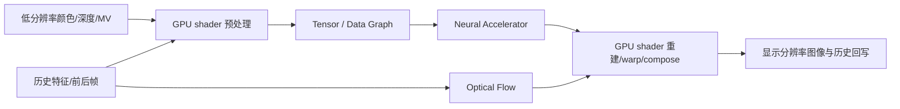

# Arm 移动 GPU 的 AI / 神经网络能力演进：从通用计算到 AI-native Neural Accelerator

> 面向移动 GPU 芯片与系统架构工程师的深度调研 
> 调研截止：**2026-09-09** 
> 资料范围：Arm 官方产品资料、架构文档、技术演讲、官方 GitHub / Hugging Face、Khronos 规范、论文与权威媒体交叉报道。

## 结论先行

Arm GPU 对 AI 的支持不是一次性加入“Tensor Core”，而是经历了四次性质不同的跃迁：

1. **Midgard / 早期 Bifrost：通用 GPU 计算承载神经网络。** 
   OpenCL、统一 shader core、FP16 和 packed INT8 使 Mali 能运行卷积、GEMM 等推理算子，但没有公开的神经网络专用执行单元。
2. **G52 / G76 至 Valhall：低精度点积、吞吐与能效持续强化。** 
   2018 年的 G52/G76 是第一个有明确官方证据加入 INT8 dot-product 的 Mali 代际；G77 把执行模型改为 Valhall 标量 ISA、16-wide warp 和硬件动态调度，随后通过更宽的 FMA、缓存、调度和软件 kernel 继续提升 ML。
3. **G715 至 G1-Ultra：矩阵指令与图形—ML 软件接口成形。** 
   G715 明确加入 matrix-multiply instruction 并把 FP16/FP32 FMA 峰值翻倍；G720/G925 的重点转向数据流、带宽和调度；2025 年 G1-Ultra 又加入明确命名的 FP16 MMUL 路径。同时，Arm 发布 `VK_ARM_tensors`、`VK_ARM_data_graph`、VGF/TOSA 工具链和开放的 NSS 模型，为专用硬件预先铺软件生态。
4. **Mali G2-Ultra NX：首次成为真正的 AI-native Mali GPU。** 
   Arm 于 2026-09-08 发布 G2-Ultra NX，首次把专用 **Neural Accelerator（NX）** 紧耦合集成进 GPU shader core，复用 GPU 内存、缓存、控制与同步，并加入 INT8/INT16 神经处理和光流加速。这里才是“通用 shader 跑 AI”到“GPU 内有专用神经硬件”的清晰分界。

对芯片设计最有价值的判断是：**Arm 的路线不是让独立 NPU 接管图形，而是在图形数据已经驻留的 GPU 域内，逐步增加低精度算术、矩阵指令、tensor/graph API、专用神经与光流硬件，从而减少跨 IP 搬运和 dispatch 延迟。** 这比单看 TOPS 更接近移动神经图形的真正瓶颈。

## 1. 范围与术语边界

本文只讨论 **Arm 设计的 Mali / Immortalis / 新命名 Mali G1、G2 GPU IP**。以下三类能力必须分开：

| 名称 | 本文如何处理 | 原因 |
| --- | --- | --- |
| Mali / Immortalis GPU | 主体 | 讨论 shader/compute、矩阵路径、Neural Accelerator、缓存与图形管线 |
| Cortex CPU 的 Armv9、SVE2、SME/SME2 | 只作为异构系统背景 | 这是 CPU ISA，不是“Mali GPU 的 Armv9 指令” |
| Ethos 或 SoC 厂商自研 NPU/APU | 只作边界说明 | 不能把其 TOPS、模型覆盖或能效算到 Mali GPU 上 |

同样需要区分：

- **支持 AI**：GPU 能通过 OpenCL/Vulkan compute/框架后端执行 NN 算子。
- **AI 优化 GPU**：加入 FP16、INT8 dot、matrix multiply、缓存或调度优化。
- **AI-native GPU**：神经加速器进入 GPU 本体，并与图形管线共享资源和同步。按 Arm 自己的命名，这一阶段始于 2026 年的 G2-Ultra NX。

## 2. 代际总表

> 表中性能百分比均为 Arm 公布的特定参考平台/工作负载结果，不是跨厂商通用结论。`ops/cycle` 资料通常把一次 FMA 计为 2 ops。

| 年份 | GPU / 架构 | AI 相关硬件变化 | 软件与 API | 证据强度与注意事项 |
| --- | --- | --- | --- | --- |
| 2013–2016 | Mali-T6xx/T7xx/T8xx，Midgard | 统一 shader/compute；OpenCL 1.1/1.2；FP16/向量算术 | OpenCL、RenderScript | 能跑 ML，但当时不是专用 NN GPU |
| 2016 | Mali-G71，Bifrost | quad/TLP 执行；原生 packed INT8/INT16/FP16；统一 core 跑 compute | OpenCL | packed INT8 不等于后来的单周期 INT8 dot |
| 2017 | Mali-G72，Bifrost | FMA/ADD 重平衡、L1 增大；Arm 称 FP16 GEMM/ML 能效 +17% | Arm Compute Library 上线 | 没有新增 tensor 单元 |
| 2018 | Mali-G52 / G76，Bifrost | **首次明确加入 INT8 dot-product**；更宽 execution engine | Arm NN、ACL、Android NNAPI GPU 路径 | Arm 称 G52 近 4× G51、G76 最高 2.7× G72，均为特定 ML benchmark |
| 2019 | Mali-G57 / G77，Valhall 1 | 标量 ISA、16-wide warp、动态调度；FP16 为 FP32 的 2×吞吐 | Arm NN + ACL OpenCL | Arm 称 G77 ML +60%；这是架构/密度综合值 |
| 2020 | Mali-G68 / G78，Valhall 2 | FMA 重构，单元能耗降低；最多 24 cores | OpenCL tuner、Winograd、FP16 FastMath | Arm 称平均 ML +15% vs G77；未披露 NN 专用单元 |
| 2021 | Mali-G310/G510/G610/G710，Valhall 3 | G710 每 core 增至两组 execution engine，64 FP32 FMA/cycle/core；CSF 重构 | Arm NN GPU zero-copy、kernel cache | Arm 称 G710 ML +35%，G510 +100% vs G57 |
| 2022 | Mali-G615/G715、Immortalis-G715，Valhall 4 | **Matrix Multiply instruction**；FMA block 翻倍；subgroup/整数位操作移入主流水 | Vulkan/OpenCL、ACL | Arm 称 2× architectural ML；不要直接称 Tensor Core 或 `VK_KHR_cooperative_matrix` |
| 2023 | Mali-G620/G720、Immortalis-G720，5th Gen | DVS 重做几何数据流、降低带宽；新增部分 FP16 超越函数 | Arm NN/ACL | FP16/FP32 峰值与 G715 同档，AI 增益不能都归因于算术峰值 |
| 2024 | Mali-G625/G725、Immortalis-G925，5th Gen 2 | tiler 与 shift-convert 吞吐翻倍、CSF 与缓存/数据流改进 | Unity Sentis INT8、Arm NN/ACL | Arm 参考平台称 AI/ML inference +36% vs G720；仍无专用 Neural Accelerator |
| 2025 | Mali G1-Pro/Premium/Ultra，5th Gen | **FP16 MMUL 路径**；G1-Ultra 的 FP16 matrix multiply 最高 2× | Vulkan ML SDK、NSS、VGF/TOSA、ExecuTorch backend | Arm 称平均推理 +20% vs G925、部分模型最高 +104%；不是专用 NX |
| 2026 | **Mali G2-Ultra NX** | **shader core 内集成 Neural Accelerator；INT8/INT16；硬件光流；共享 GPU cache/memory/control** | NSS、NFRU、NSSD；原生 Vulkan ML extensions | Arm 首款 AI-native Mali；IP 已发布，终端量产和独立实测仍待后续 |

## 3. 第一阶段：从 Midgard 通用计算到 Bifrost 的窄精度基础

### 3.1 Midgard：先解决“GPU 能不能执行 ML”

Mali-T700 系列已经支持 OpenCL 1.2，Midgard 采用统一 shader core，可执行图形和 compute workload。Arm 的 [Mali GPU OpenCL Developer Guide](https://developer.arm.com/-/media/developer/Graphics%20and%20Multimedia/Developer%20Guides%20-%20PDFs/Arm%20Guide%20to%20OpenCL%20Programming.pdf?la=en&revision=44b43b2c-dc81-4ef6-96dd-5ead4da5dbf2) 明确把 T600/T700/T800 纳入 OpenCL 优化对象；[Mali-T760/T720 发布资料](https://developer.arm.com/community/arm-community-blogs/b/mobile-graphics-and-gaming-blog/posts/introducing-the-arm-mali-t700-gpu-series-innovated-to-efficiently-power-the-next-generation-of-devices)也列出 OpenCL 1.2。

这一时期的意义是建立 **GPGPU 可编程性**，不是加入专用 AI 硬件。CNN 的 convolution/GEMM 可以被拆为 OpenCL kernel，但调度、张量布局、kernel fusion 和量化支持主要依赖软件。

### 3.2 G71/G72：Bifrost 改变执行模型，优化 FP16 GEMM

[Bifrost shader core 官方解析](https://developer.arm.com/community/arm-community-blogs/b/mobile-graphics-and-gaming-blog/posts/the-mali-gpu-an-abstract-machine-part-4---the-bifrost-shader-core)显示，G71 仍是 unified shader core，但从 Midgard 更偏 ILP/VLIW 的组织转向以四线程 quad 为中心的 TLP 执行，128-bit 数据通路原生支持 packed INT8/INT16/FP16。这里提供了低精度算术的物理基础，但不能据此声称已经具有 G52/G76 的单周期 NN dot-product。

G72 的重点是重平衡 FMA/ADD 单元、增大 L1，并减少外部访存。Arm 用 GEMM 作为 ML proxy，给出的结果是 FP16 GEMM/ML 能效提高 17%；详见 [Why GPUs and Machine Learning are a Perfect Match](https://developer.arm.com/community/arm-community-blogs/b/mobile-graphics-and-gaming-blog/posts/why-gpus-and-machine-learning-are-a-perfect-match) 与 [Mali-G72 技术说明](https://developer.arm.com/community/arm-community-blogs/b/mobile-graphics-and-gaming-blog/posts/mali-g72-enabling-tomorrows-technology-today)。

对芯片工程师而言，这一代的经验是：卷积/GEMM 不仅受 FMA 峰值约束，**L1 容量、global-memory traffic、工作组映射和持续频率**同样决定移动端能效。

## 4. 第二阶段：INT8 dot-product 与 Valhall 吞吐扩展

### 4.1 G52/G76：面向量化推理的第一个明确硬件拐点

2018 年 [Mali-G52 发布资料](https://developer.arm.com/community/arm-community-blogs/b/mobile-graphics-and-gaming-blog/posts/mainstream-mobile-bringing-premium-experiences-to-millions-more-consumers)明确写入 INT8 dot-product，并称在图像检测等 ML benchmark 上接近 G51 的 4 倍；[Mali-G76 技术说明](https://developer.arm.com/community/arm-community-blogs/b/mobile-graphics-and-gaming-blog/posts/mali-g76-taking-high-end-graphics-to-the-next-level)则把同代的宽 execution engine 与 INT8 dot 结合，称最高达到 G72 的 2.7 倍 ML 性能。

这一代开始，量化不再只是“用更小的数据节省带宽”，而是可以直接提高 dot-product 的算术密度。需要注意 G52 与 G76 分属 mainstream/premium 路线，稳妥说法是：**G52/G76 这一代首次有明确官方证据加入 INT8 dot-product**，而不是武断地为全产品线指定唯一“首款”。

### 4.2 G77：Valhall 让编译器和 warp 利用率成为主角

G77 引入 Valhall：简化的 scalar ISA、硬件动态调度、16-wide warp 和新的 superscalar execution engine。[Arm G77 发布说明](https://developer.arm.com/community/arm-community-blogs/b/mobile-graphics-and-gaming-blog/posts/introducing-arm-mali-g77-with-new-valhall-architecture)给出性能密度 +30%、能效 +30%、ML +60%；[Valhall Shader Core User Guide](https://developer.arm.com/-/media/Arm%20Developer%20Community/PDF/The%20Valhall%20Shader%20Core.pdf?revision=eb631d12-3e53-490d-9b32-2d3842a805a5)给出更有工程价值的结构：G57/G77 每 core 两个 PE，FMA/CVT 为 16-wide，SFU 为 4-wide，32 个 32-bit 寄存器可维持满 occupancy。

[Arm NN GPU inference 的 FP16 说明](https://developer.arm.com/community/arm-community-blogs/b/ai-blog/posts/making-the-most-of-arm-nn-for-gpu-inference)列出 G77 每 core 64 FP32 ops/cycle、128 FP16 ops/cycle，并强调 FP16 同时减半存储/带宽与提高吞吐。由此可见 Valhall 的 ML 提升来自 **执行宽度、调度、寄存器占用、精度与软件 kernel 的共同作用**。

### 4.3 G78 与 G710：持续能效、扩大 core 内吞吐

G78 并未公开新增神经网络专用单元。Arm 表示 FMA 单元能耗降低 30%，各类 ML workload 平均比 G77 快 15%；同时明确 CPU/NPU 仍是主要 ML 处理器，GPU 更适合相机、视频、AR、安全等并行 workload。参见 [Mali-G78 官方技术文章](https://developer.arm.com/community/arm-community-blogs/b/mobile-graphics-and-gaming-blog/posts/arm-mali-g78-gpu)。

G710 把每 shader core 的 execution engine 增至两组，达到 64 FP32 FMA/cycle/core，并重做 Command Stream Frontend（CSF）。Arm 公布相对 G78 的 ML +35%；G510 将类似思路下放到 mainstream，公布相对 G57 的 ML +100%。参见 [2021 Mali GPU family 发布资料](https://developer.arm.com/community/arm-community-blogs/b/mobile-graphics-and-gaming-blog/posts/new-suite-of-arm-mali-gpus)与 [G710 developer overview](https://developer.arm.com/community/arm-community-blogs/b/mobile-graphics-and-gaming-blog/posts/mali-g710-developer-overview)。

## 5. 第三阶段：矩阵指令、5th Gen 数据流与 G1 FP16 MMUL

### 5.1 G715：矩阵乘法进入公开功能列表

2022 年的 Mali-G715 / Immortalis-G715 是第二个关键转折点：官方资料明确列出 **Matrix Multiply instruction**、FMA block/吞吐翻倍，以及 subgroup 和 integer bitwise 指令从 SFU 移到主流水，相关操作最高 4 倍。Arm 将这一代概括为“2× architectural ML improvements”。参见 [2022 GPU family 发布资料](https://developer.arm.com/community/arm-community-blogs/b/announcements/posts/gaming-performance-unleashed)和 [Immortalis-G715 developer overview](https://developer.arm.com/community/arm-community-blogs/b/mobile-graphics-and-gaming-blog/posts/arm-immortalis-g715-developer-overview)。

但公开资料没有给出 matrix instruction 的 tile shape、accumulator precision，也没有证明设备对外暴露 `VK_KHR_cooperative_matrix`。因此报告不把它称为 Tensor Core，也不把内部指令等同于 Vulkan cooperative matrix。

### 5.2 G720/G925：峰值算术不变，优化系统数据流

5th Gen 的 G720 通过 Deferred Vertex Shading 重做几何管线，重点是降低中间数据与 DRAM traffic，而不是再翻倍 FMA。Arm 公布的 G715 与 G720 FP16/FP32 每 core 峰值处于同档，这意味着某些 AI 增益更可能来自内存系统、调度与软件优化。参见 [5th Gen GPU architecture 发布](https://developer.arm.com/community/arm-community-blogs/b/announcements/posts/arm-gpus-built-on-new-fifth-gen-architecture)。

2024 年 G925 又把 tiler 和 shift-convert throughput 翻倍，改进 CSF，并扩至 24 cores。Arm Reference Platform 的结果为：AI/ML inference +36% vs G720；图像分类/分割 +41%；神经超分接近 +30%；NLP/语音转文字 +50%。Unity Sentis 切到 INT8 后另有 +44%，但这是软件与精度路径的综合收益。详见 [Immortalis-G925 官方发布解析](https://newsroom.arm.com/blog/arm-gpus-consumer-devices)和 [产品页](https://www.arm.com/products/silicon-ip-multimedia/immortalis-gpu/immortalis-g925)。

### 5.3 G1-Ultra：专用 NX 之前的 FP16 MMUL 过渡代

2025 年 Mali G1-Ultra 加入明确命名的 FP16 Matrix Multiply Unit / MMUL instruction。Arm 称相对 G925，跨 AI/ML 网络平均推理提升 20%，部分语义分割、去噪、深度估计、目标检测、语音和图像增强 workload 最高提升 104%；产品页还称 FP16 matrix multiply 最高 2×。参见 [G1-Ultra 官方技术博客](https://newsroom.arm.com/blog/arm-mali-g1-ultra-gpu-gaming-ai)与 [产品页](https://www.arm.com/products/silicon-ip-multimedia/gpu/mali-g1-ultra)。

G1 的战略价值是验证矩阵密集路径并为神经图形准备算力，但 Arm 对“dedicated neural accelerators”的预告仍明确指向 2026 GPU。因此，**G1 是增强矩阵路径的通用 GPU，G2-Ultra NX 才是专用神经硬件进入 GPU 的一代**。

## 6. 第四阶段：G2-Ultra NX 把 Neural Accelerator 放进 shader core

Arm 在 2026-09-08 发布 [Mali G2-Ultra NX](https://www.arm.com/products/silicon-ip-multimedia/gpu/mali-g2-ultra-nx)。[官方架构博客](https://newsroom.arm.com/blog/arm-mali-g2-ultra-nx-ai-native-mobile-graphics)给出的关键点包括：

- Neural Accelerator 紧耦合集成在 shader core 内；
- 支持 INT8 / INT16 神经处理；
- 为 NFRU 提供硬件光流路径；
- 与传统 graphics/compute 共享 GPU memory system、coherent cache、control 与 synchronization；
- 新 execution engine 是七代以来最大 ISA 重构之一，寄存器资源最高增加 2×；
- 结合 NSS/NFRU/NSSD，Arm 宣称神经图形能效最高 4×，Neural Dawn 演示外部内存流量最高降低 70%；
- 传统游戏性能最高 +14%、benchmark 最高 +24%，均为 Arm 内部指定条件结果。

这条集成方式直接针对 2024 SIGGRAPH 演讲指出的移动痛点：传统 SoC 虽已有 NPU，但图形应用难以低延迟调用，缺乏统一图形 API、共享资源与细粒度同步。把 NX 放入 GPU 域后，不必把 color/depth/motion/history 在 GPU 与外部 NPU 间来回转换和搬运，也减少独立 accelerator dispatch 的固定开销。

截至 2026-09-09，G2-Ultra NX 是**刚发布的可授权 GPU IP**。官方已展示生态合作与游戏集成，但终端量产覆盖、第三方画质对比、持续功耗和真实 die-area 代价仍缺乏独立实测。The Register 的 [发布报道](https://www.theregister.com/systems/2026/09/08/arm-pushes-agentic-ai-and-desktop-quality-graphics-in-next-gen-phone-platform/5294867)也将其描述为 Arm 首个带神经加速的 GPU，并指出仍需芯片客户完成落地。

## 7. 软件栈演进：硬件之外的另一半

### 7.1 Arm Compute Library 与 Arm NN：传统 GPU inference 路线

2017 年起，[Arm Compute Library](https://github.com/ARM-software/ComputeLibrary)提供面向 Mali 的 OpenCL ML kernels，包含 GEMM、Winograd、卷积、kernel fusion、OpenCL tuner，以及 FP32/FP16/INT8/UINT8 等路径。上层 [Arm NN](https://github.com/ARM-software/armnn)通过 `GpuAcc` backend 调用 ACL，可接 TensorFlow Lite、ONNX 与 Android NNAPI。

2020–2021 年的关键软件优化包括：

- OpenCL tuner 针对 GPU/kernel/shape 搜索配置；
- FP16 FastMath 和 Winograd；
- kernel binary cache，降低首次执行编译开销；
- GPU zero-copy，减少输入输出复制；
- Streamline 关联 Arm NN layer 与 Mali non-fragment queue。

相关实测例子见 [OpenCL tuner：Mali-G72 分割网络 24 ms → 18 ms](https://developer.arm.com/community/arm-community-blogs/b/ai-blog/posts/arm-nn-gpu-inference-with-opencl-tuner)和 [2021 Arm NN/ACL 技术演讲](https://developer.arm.com/-/media/Arm%20Developer%20Community/PDF/AI%20Tech%20Talks/ArmNN%202011%20release%20Feb%209th.pdf?hash=62EC303C52AF489B5564ADD13D2BE0FD2BFD67B8&revision=0d2c361f-3679-4ee1-8a86-1d8e04f810a1)。

需要特别注意：Arm NN 当前 GitHub 首页已标注为 **legacy、Arm 不再主动维护**。因此新项目不应把 Arm NN 当作未来神经图形的主接口；ACL 仍可作为 OpenCL kernel 与历史平台基线，而新路线已转向 ExecuTorch/TOSA/Vulkan ML。

### 7.2 Vulkan ML：把 tensor 与 graph 变成图形 API 的一等对象

[ML SDK for Vulkan](https://developer.arm.com/mobile-graphics-and-gaming/ml-sdk-vulkan)围绕两项扩展构建：

- [`VK_ARM_tensors`](https://docs.vulkan.org/refpages/latest/refpages/source/VK_ARM_tensors.html)：tensor 对象、view、memory binding、image aliasing；
- [`VK_ARM_data_graph`](https://docs.vulkan.org/refpages/latest/refpages/source/VK_ARM_data_graph.html)：data-graph pipeline、session、常量与 dispatch；
- NFRU 另用 `VK_ARM_data_graph_optical_flow`；
- 图模型由 TOSA 转为 SPIR-V graph，再封装进 VGF；
- VGF Library 负责装载，Scenario Runner 做声明式验证，Model Converter 负责 TOSA → VGF；
- [Emulation Layer](https://github.com/arm/ai-ml-emulation-layer-for-vulkan)能在任意 Vulkan compute GPU 上模拟这些接口。

Khronos 记录显示，`VK_ARM_tensors` revision 1 为 2025-06-03，`VK_ARM_data_graph` revision 1 为 2025-06-18，`VK_ARM_data_graph_optical_flow` revision 1 为 2026-04-08；截至本报告日期三者均为 **ARM vendor extension、Not ratified**，不是 Vulkan core 或 KHR 扩展，不能假定普通 Android Vulkan GPU 都支持。

最后一点是重要的验证边界：**在 G715/G720/G925 上通过 emulation layer 跑通 NSS，不代表这些 GPU 原生具有 NX 或 Vulkan ML 硬件实现。** 必须查询扩展、驱动和 queue-family 能力，并分别记录 native 与 emulated 路径。

### 7.3 开放工具链的版本节点

| 日期 | 公开组件 | 关键变化 |
| --- | --- | --- |
| 2025-08 | Neural Graphics Model Gym v0.1、Hugging Face NSS | 首版可训练 NSS、FP32/INT8 权重、VGF、场景资源 |
| 2025-10 | ML SDK for Vulkan v2025.10、Emulation Layer v0.7 | Vulkan ML 工具链正式公开；ExecuTorch 1.0 backend 路径 |
| 2025-10 | Neural Graphics SDK v1.0 | NSS 与 Unreal 插件；Windows/Linux 模拟验证 |
| 2026-03/04 | NFRU Early Access、Vulkan SDK v2026.03 | 引入 frame interpolation 与 optical-flow data graph |
| 2026-06/07 | Vulkan SDK v2026.06、Neural Graphics SDK v1.1 | NFRU 公开 SDK、Android AArch64、NSS/NFRU 统一集成 |
| 2026-08 | Model Gym v0.4 | NSS v1、High/Mid/Low、可变倍率；NFRU/QAT/导出更新 |
| 2026-09 | G2-Ultra NX | 这些接口首次对应 Arm 明确公布的原生专用神经 GPU 硬件 |

版本可直接查看 [Model Gym releases](https://github.com/arm/neural-graphics-model-gym/releases)、[Neural Graphics SDK releases](https://github.com/arm/neural-graphics-sdk-for-game-engines/releases)与 [ML SDK for Vulkan releases](https://github.com/arm/ai-ml-sdk-for-vulkan/releases)。

## 8. Arm 神经图形技术与模型到底做什么

### 8.0 ASR：重要的非神经基线

[Arm Accuracy Super Resolution（ASR）](https://developer.arm.com/community/arm-community-blogs/b/mobile-graphics-and-gaming-blog/posts/introducing-arm-accuracy-super-resolution)于 2024 年公开，源自 AMD FSR 2.2.2，是面向移动 GPU 带宽和 shader 成本优化的**非神经时域超分**。2025 年 Arm 又发布开源 experience kit；代码见 [accuracy-super-resolution](https://github.com/arm/accuracy-super-resolution)和 [generic library](https://github.com/arm/accuracy-super-resolution-generic-library)。

把 ASR 纳入时间线很重要：它证明 GPU workload 降低并不天然要求 AI，也为 NSS 提供了同一移动管线中的传统基线。做芯片评估时应至少同时比较 native、bilinear、ASR、NSS-emulated 与 NSS-native，才能分离“时域算法收益”和“神经硬件收益”。

### 8.1 NSS：小 CNN 预测参数，shader 完成重建

[NSS v1 模型](https://huggingface.co/Arm/neural-super-sampling)不是端到端直接生成 RGB 的大模型。输入包含低分辨率 color、depth、motion vector、曝光、disocclusion、历史反馈与 luma derivative；GPU compute shader 先预处理并重投影历史特征，小型 U-Net 风格 CNN 预测：

- KPN 空间滤波参数；
- 4 通道 temporal fusion 参数。

随后 shader 后处理生成高分辨率图像并更新历史。当前 [NSS v1 源码](https://github.com/arm/neural-graphics-model-gym/blob/main/src/ng_model_gym/usecases/nss/model/model_blocks_v1.py)只使用 3×3 Conv、ReLU、stride-2 下采样、nearest 上采样与 skip concatenation，不含 Transformer/attention。按公开层定义计算：

- High（6×6 KPN）约 **148,456** 个可训练参数；
- Mid/Low（4×4 KPN）约 **142,676** 个可训练参数；
- High 用全输入分辨率预处理、更大的 KPN/filter；Mid/Low 降低预处理/深度处理分辨率并使用稀疏 2×2 filter。

Arm 在 2025 demo 中给出的目标是 540p → 1080p、约 4 ms，并称可节省最高 50% GPU workload；这些是 Arm 演示结果，不能代替目标芯片实测。架构与训练细节见 [How Neural Super Sampling Works](https://developer.arm.com/community/arm-community-blogs/b/mobile-graphics-and-gaming-blog/posts/how-arm-neural-super-sampling-works)和 [NSS Use Case Guide](https://documentation-service.arm.com/static/689c51eee7f7ce6150e89527?token=)。

### 8.2 NFRU：光流 + 引擎 MV + 小 CNN 的混合系统

进一步阅读：[Motion Engine 专题](../motion-engine/README.md)，包含四尺度块匹配计算量、CNN 逐层 MAC、SDK 分辨率上限，以及参考模型与 SDK hint 来源的差异。

[NFRU](https://huggingface.co/Arm/neural-frame-rate-upscaling)在两张真实渲染帧之间生成一张中间帧，是**插值**而不是外推，因此需要等待未来真实帧并安排送显。不能笼统认定固定增加一帧延迟；Arm 演讲表述及其时序边界见 [Motion Engine 专题](../motion-engine/README.md#8-自研移动-gpu-应测什么)。当前公开实现包含：

- 引擎 motion vector；
- 六层 block-matching optical flow；
- warp、disocclusion/hole filling、compose shader；
- 16 通道输入、32 通道隐藏、16 通道分支、4 通道输出的轻量卷积 autoencoder；
- 1×1/3×3/5×5/7×7 多感受野分支；
- INT8 QAT 与 VGF 导出。

源码入口：[NFRU v1 pipeline](https://github.com/arm/neural-graphics-model-gym/blob/main/src/ng_model_gym/usecases/nfru/model/nfru_v1.py)、[NFRU CNN](https://github.com/arm/neural-graphics-model-gym/blob/main/src/ng_model_gym/usecases/nfru/model/nfru_v1_nn.py)、[SDK user guide](https://github.com/arm/neural-graphics-sdk-for-game-engines/blob/main/docs/user_guide.md)。G2-Ultra NX 增加硬件光流，说明帧生成的瓶颈不只是 CNN MAC，还包括 correspondence search、warp、遮挡和送显节奏。

### 8.3 NSSD：光追稀疏采样的联合去噪与超分

NSSD 面向稀疏光追输出，同时去噪和放大，公开重点是减少 rays/pixel、外部带宽与全分辨率 shading。2026 SIGGRAPH 的 [Neural Super Sampling and Denoising 演讲入口](https://developer.arm.com/community/arm-community-blogs/b/mobile-graphics-and-gaming-blog/posts/moving-mobile-graphics)和 [Arm Neural Technology 页面](https://developer.arm.com/mobile-graphics-and-gaming/neural-technology)已把它列为第三项核心技术；截至本次调研，公开程度仍低于 NSS/NFRU，不能假定它复用完全相同的网络或训练配方。

## 9. 推荐优先观看/阅读的 Arm 演讲与论文

### 第一优先级：直接解释 Arm 路线

1. **SIGGRAPH 2024 — Mobile Neural Super Sampling，Liam O'Neil（Arm）** 
   [带 speaker notes 的 PDF](https://developer.arm.com/cfs-file/__key/communityserver-blogs-components-weblogfiles/00-00-00-20-66/siggraph_5F00_mmg_5F00_2024_5F00_mobile_5F00_nss_2D00_LiamONeil_2D00_v7_2D00_speakers_5F00_notes.pdf) · [ACM 课程录像入口](https://dl.acm.org/doi/10.1145/3664475.3664528) 
   最重要的历史证据：当时 Arm 已明确指出移动 NPU 对图形的 dispatch latency、资源共享与统一 API 缺口，并提出加速器应“像 GPU 的一部分”。其中约 10 GOP、≤4 ms、>10 TOPS/W 等是对未来硬件的估算框架，不是 2024 年量产 GPU 实测。
2. **SIGGRAPH 2025 — Mobile Neural Super Sampling / Arm Neural Technology** 
   [论文/演讲 PDF（Hugging Face）](https://huggingface.co/Arm/neural-super-sampling/blob/main/2025-neural-super-sampling.pdf) · [NSS 发布说明](https://developer.arm.com/community/arm-community-blogs/b/mobile-graphics-and-gaming-blog/posts/how-to-access-arm-neural-super-sampling) 
   从研究原型进入 SDK、模型、训练和 Vulkan ML 接口阶段。
3. **GDC Festival of Gaming 2026 — NFRU** 
   [Arm 官方发布与技术概览](https://developer.arm.com/community/arm-community-blogs/b/mobile-graphics-and-gaming-blog/posts/new-neural-technologies-set-to-join-the-neural-graphics-development-kit) 
   展示超分之外的插帧、运动估计和固定延迟设计。
4. **SIGGRAPH 2026 Moving Mobile Graphics — NSSD，Liam O'Neil（Arm）** 
   [课程资料与 NSSD PDF 入口](https://developer.arm.com/community/arm-community-blogs/b/mobile-graphics-and-gaming-blog/posts/moving-mobile-graphics) 
   观察 neural upscaling、denoising 与移动光追如何合流。
5. **2026 G2-Ultra NX 发布架构解析** 
   [Inside Mali G2-Ultra NX](https://newsroom.arm.com/blog/arm-mali-g2-ultra-nx-ai-native-mobile-graphics) 
   当前最直接的 NX 位置、INT8/INT16、光流和共享 GPU 资源说明。

### 第二优先级：理解旧 GPU inference 与硬件约束

- [Arm NN — AI Virtual Tech Talk（2020）](https://developer.arm.com/-/media/Arm%20Developer%20Community/PDF/AI%20Tech%20Talks/Arm%20NN%20-%20AI%20Tech%20Talk%20Sep%208th)：Arm NN、ACL、OpenCL GPU backend 的全栈关系。
- [Supercharge Arm NN and Compute Library（2021）](https://developer.arm.com/-/media/Arm%20Developer%20Community/PDF/AI%20Tech%20Talks/ArmNN%202011%20release%20Feb%209th.pdf?hash=62EC303C52AF489B5564ADD13D2BE0FD2BFD67B8&revision=0d2c361f-3679-4ee1-8a86-1d8e04f810a1)：模型级 benchmark、tuner、FastMath。
- [Valhall Shader Core User Guide](https://developer.arm.com/-/media/Arm%20Developer%20Community/PDF/The%20Valhall%20Shader%20Core.pdf?revision=eb631d12-3e53-490d-9b32-2d3842a805a5)：warp、PE、FMA/CVT/SFU、register occupancy。
- [High Performance Graphics 2017 — Compressing DNNs with ASTC](https://developer.arm.com/community/arm-community-blogs/b/mobile-graphics-and-gaming-blog/posts/high-performing-graphics-2017-compressing-deep-neural-networks-with-astc)：从权重压缩与纹理硬件复用理解早期移动 GPU 的带宽思路。

### 外部论文：用于校准 Arm 方案，不作为 Arm 产品证据

- [Achieving On-Mobile Real-Time Super-Resolution With Neural Architecture and Pruning Search，ICCV 2021](https://openaccess.thecvf.com/content/ICCV2021/html/Zhan_Achieving_On-Mobile_Real-Time_Super-Resolution_With_Neural_Architecture_and_Pruning_Search_ICCV_2021_paper.html)：以真实移动 GPU 延迟约束做 NAS/剪枝。
- [RenderSR: A Lightweight Super-Resolution Model for Mobile Gaming Upscaling，CVPRW 2022](https://openaccess.thecvf.com/content/CVPR2022W/MobileAI/html/Dong_RenderSR_A_Lightweight_Super-Resolution_Model_for_Mobile_Gaming_Upscaling_CVPRW_2022_paper.html)：移动游戏单图 SR 的轻量设计。
- [MobileNeRF，2022](https://arxiv.org/abs/2208.00277)：用标准 polygon rasterization + 小 MLP 映射 neural rendering，说明传统图形固定功能仍有价值。
- [Physics Simulation With Graph Neural Networks Targeting Mobile，Arm 2025](https://developer.arm.com/community/arm-community-blogs/b/mobile-graphics-and-gaming-blog/posts/physics-simulation-graph-neural-networks-targeting-mobile)：Arm 对神经图形之外 GNN workload 的探索信号。

## 10. 对自研移动 GPU 芯片的架构启示

### 10.1 不要从 TOPS 开始，应从完整帧图的数据流开始

NSS/NFRU 的真实链路是：

要同时预算：image↔tensor alias、layout transition、cache residency、queue sync、dispatch 固定成本、shader↔NX producer-consumer latency、光流和后处理带宽。一个高 TOPS 但需要出 GPU cache、跨 interconnect 拷贝到独立 NPU 的方案，可能输给较小但紧耦合的 GPU 内加速器。

### 10.2 建议的硬件优先级

1. **共享虚拟地址、coherent cache 与 image/tensor aliasing**，避免显式重排/拷贝。
2. **INT8/INT16 MAC + 合理 accumulator 精度**，匹配当前 Arm 模型的 QAT 路线；同时保留 FP16 处理 HDR/训练敏感阶段。
3. **低延迟 data-graph dispatch**，支持图形 command buffer 内的细粒度依赖。
4. **针对 3×3/5×5/7×7 小 CNN 的数据复用**，而不是只为大 GEMM 做峰值优化。
5. **光流/warp/resize/activation/quantize 等邻接算子**的融合或固定功能支持。
6. **可观测性**：至少暴露 NX active/stall、MAC utilization、tensor cache hit、shader↔NX wait、graph dispatch latency、image/tensor traffic、optical-flow cycles。
7. **降级路径**：无 NX 时可在 Vulkan compute 上模拟/回退，保证软件先行和跨代兼容。

### 10.3 建议的 PPA / 性能评估矩阵

| 维度 | 最少应测内容 |
| --- | --- |
| 模型 | NSS High/Mid/Low INT8、NFRU INT8、至少一个传统 CNN segmentation |
| 分辨率 | 540p→1080p、720p→1440p；动态比例与固定 2× |
| 路径 | shader-only、MMUL、NX native、外部 NPU（如可用） |
| 时间 | preprocess、graph dispatch、inference、postprocess、optical flow、present pacing 分拆计时 |
| 存储 | 权重、activation peak、history、KPN、flow、temporary surface |
| 带宽 | L2/SLC hit、external read/write、image↔tensor 转换、历史反馈 |
| 功耗 | 峰值和 10/20 分钟 sustained；固定 FPS 与固定画质两种口径 |
| 画质 | PSNR/SSIM/LPIPS + 细线、粒子、透明、镜面、disocclusion、快速旋转主观序列 |
| 延迟 | NSS 单帧链路；NFRU 等待、计算、送显与 input-to-photon；不要只报告 delivered FPS |

## 11. 可直接复现的开源入口

- [Neural Graphics SDK for Game Engines](https://github.com/arm/neural-graphics-sdk-for-game-engines)：NSS/NFRU 集成、Vulkan backend、Windows/Linux/Android AArch64 sample。
- [Neural Graphics Model Gym](https://github.com/arm/neural-graphics-model-gym)：训练、微调、评估、QAT INT8、VGF 导出；NSS/NFRU 源码。当前项目明确标为 beta；训练主机要求 Ubuntu 22.04/24.04 与 NVIDIA CUDA GPU，这与模型部署到 Arm 移动 GPU 是两个阶段。
- [Model Gym Examples](https://github.com/arm/neural-graphics-model-gym-examples)：训练、QAT、评估、fine-tune notebooks。
- [Arm NSS on Hugging Face](https://huggingface.co/Arm/neural-super-sampling)：FP32/INT8 checkpoint、VGF、场景与论文。
- [Arm NFRU on Hugging Face](https://huggingface.co/Arm/neural-frame-rate-upscaling)：NFRU 模型资源。
- [Neural Graphics Dataset](https://huggingface.co/datasets/Arm/neural-graphics-dataset)：训练/验证/测试序列；截至 2026-09-09 仓库文件合计约 35.3 GB，仍是教学/微调样本，Arm 未公开完整生产训练集。
- [ML SDK for Vulkan](https://github.com/arm/ai-ml-sdk-for-vulkan)：总入口与 manifest。
- [Vulkan ML Emulation Layer](https://github.com/arm/ai-ml-emulation-layer-for-vulkan)：tensor/data graph/TOSA/optical-flow 的 compute 模拟与 profiling。
- [ML SDK Model Converter](https://github.com/arm/ai-ml-sdk-model-converter)：TOSA → SPIR-V graph → VGF。
- [Arm Compute Library](https://github.com/ARM-software/ComputeLibrary)：传统 Mali OpenCL ML baseline。
- [Arm Performance Studio](https://developer.arm.com/Tools%20and%20Software/Arm%20Performance%20Studio)与 [RenderDoc for Arm GPUs](https://developer.arm.com/tools-and-software/renderdoc-for-arm-gpus)：GPU counters、frame capture、tensor 可视化和 Vulkan ML 调试。

## 12. 证据缺口与风险

1. **NX 微架构尚未完整公开。** 未获得阵列维度、MAC/cycle、局部 SRAM 容量/端口、accumulator 类型、每 core 面积、频率、电源域和具体 tensor layout。
2. **G715 的 matrix instruction 细节有限。** 不能由名称推导 tile shape、合作矩阵 API 或等价于桌面 Tensor Core。
3. **Arm 百分比多来自 reference platform。** 工艺、core 数、频率、内存、模型和软件版本会共同影响结果，不能直接用于竞品 PPA 排名。
4. **G2-Ultra NX 刚发布。** 量产设备、驱动成熟度、独立 benchmark 与长时间功耗数据尚不足。
5. **公开模型代表性有限。** NSS/NFRU 都是轻量参数预测/融合网络，不能代表 LLM、diffusion 或大视觉 Transformer 对 GPU/NPU 的需求。
6. **授权实现可配置。** 同 Mali IP 的 core 数、cache、频率和系统互连由 licensee 决定，同一 GPU 名称的终端表现可显著不同。
7. **“公开”不等于统一的开源许可证。** Model Gym 等代码主要使用 Apache-2.0，ASR 为 MIT；Hugging Face 权重、场景与部分内容使用 [Arm AI Model Community License](https://huggingface.co/Arm/neural-super-sampling/blob/main/Arm_AI_Model_Community_License_v1_0_PRE-1154.pdf)。商用和再分发前应分别审查。
8. **Arm 的 NSS/NFRU“论文”主要是课程演讲或技术白皮书。** 它们是高价值一手设计资料，但不等同于完整同行评审论文；目前也缺少独立团队在 G2-Ultra NX 真机上的复现。

## 13. 资料选择与停止条件

本报告先按“硬件代际、执行精度、软件/API、神经图形 workload、公开演讲、可复现资产”建立证据槽位，再对 G71/G52/G77/G715/G1/G2 六个关键转折点做二次核验。高影响主张均至少有 Arm 一手材料；G2 的市场状态另用权威媒体交叉确认。对未公开的 NX 阵列、G715 matrix tile 和终端 PPA 不做猜测。

继续搜索已主要返回重复的发布稿或缺乏新增微架构信息的二手报道，因此在以下条件满足后停止：完整代际链已闭合；“GPU vs CPU/NPU”“通用 compute vs 专用 NX”“模拟扩展 vs 原生支持”的边界已明确；2026-09-08 最新发布已纳入；源码、模型、数据集和演讲均有直达链接。

## 14. 核心来源台账

| 主张族 | 来源与发布者 | 日期 | 用途 / 访问说明 |
| --- | --- | --- | --- |
| Midgard OpenCL | [Mali GPU OpenCL Developer Guide](https://developer.arm.com/-/media/developer/Graphics%20and%20Multimedia/Developer%20Guides%20-%20PDFs/Arm%20Guide%20to%20OpenCL%20Programming.pdf?la=en&revision=44b43b2c-dc81-4ef6-96dd-5ead4da5dbf2)，Arm | 2017 版 | 官方 PDF；确认 T/G family OpenCL、FP16 优化 |
| Bifrost core | [The Bifrost Shader Core](https://developer.arm.com/community/arm-community-blogs/b/mobile-graphics-and-gaming-blog/posts/the-mali-gpu-an-abstract-machine-part-4---the-bifrost-shader-core)，Peter Harris / Arm | 2016-08-26 | 一手微架构 |
| G72 ML | [Why GPUs and ML are a Perfect Match](https://developer.arm.com/community/arm-community-blogs/b/mobile-graphics-and-gaming-blog/posts/why-gpus-and-machine-learning-are-a-perfect-match)，Arm | 2017-08-07 | FMA/L1/FP16 GEMM |
| INT8 dot | [Mali-G52 launch](https://developer.arm.com/community/arm-community-blogs/b/mobile-graphics-and-gaming-blog/posts/mainstream-mobile-bringing-premium-experiences-to-millions-more-consumers)，Arm | 2018-03-06 | 明确 INT8 dot-product |
| Valhall | [Mali-G77 / Valhall](https://developer.arm.com/community/arm-community-blogs/b/mobile-graphics-and-gaming-blog/posts/introducing-arm-mali-g77-with-new-valhall-architecture)，Arm | 2019-05 | 架构与 ML +60% |
| Valhall 定量 | [Valhall Shader Core User Guide](https://developer.arm.com/-/media/Arm%20Developer%20Community/PDF/The%20Valhall%20Shader%20Core.pdf?revision=eb631d12-3e53-490d-9b32-2d3842a805a5)，Arm | 2020 | PE/warp/FMA/register |
| G78/G710 | [G78](https://developer.arm.com/community/arm-community-blogs/b/mobile-graphics-and-gaming-blog/posts/arm-mali-g78-gpu)；[2021 GPU family](https://developer.arm.com/community/arm-community-blogs/b/mobile-graphics-and-gaming-blog/posts/new-suite-of-arm-mali-gpus)，Arm | 2020/2021 | ML uplift 与 core 扩展 |
| G715 matrix | [Immortalis-G715 developer overview](https://developer.arm.com/community/arm-community-blogs/b/mobile-graphics-and-gaming-blog/posts/arm-immortalis-g715-developer-overview)，Arm | 2023-03-20 | FMA、matrix、narrow counters |
| 5th Gen | [5th Gen GPU architecture](https://developer.arm.com/community/arm-community-blogs/b/announcements/posts/arm-gpus-built-on-new-fifth-gen-architecture)，Arm | 2023-05-29 | DVS、带宽、系统能效 |
| G925 AI | [Arm G925/G725/G625](https://newsroom.arm.com/blog/arm-gpus-consumer-devices)，Anand Patel / Arm | 2024-05-29 | Reference Platform AI benchmark |
| G1 MMUL | [Mali G1-Ultra](https://newsroom.arm.com/blog/arm-mali-g1-ultra-gpu-gaming-ai)，Anand Patel / Arm | 2025-09-10 | FP16 MMUL 与推理 uplift |
| 神经图形需求 | [SIGGRAPH 2024 Mobile NSS](https://developer.arm.com/cfs-file/__key/communityserver-blogs-components-weblogfiles/00-00-00-20-66/siggraph_5F00_mmg_5F00_2024_5F00_mobile_5F00_nss_2D00_LiamONeil_2D00_v7_2D00_speakers_5F00_notes.pdf)，Liam O'Neil / Arm | 2024-08 | NPU dispatch/共享/API 痛点 |
| NSS | [How NSS Works](https://developer.arm.com/community/arm-community-blogs/b/mobile-graphics-and-gaming-blog/posts/how-arm-neural-super-sampling-works)，Liam O'Neil / Arm | 2025-08-12 | 模型、时间反馈、预后处理 |
| Vulkan ML | [Khronos Vulkan Specification](https://registry.khronos.org/vulkan/specs/latest/pdf/vkspec.pdf)；[Arm SDK](https://github.com/arm/ai-ml-sdk-for-vulkan) | 2025–2026 | tensor/data graph 规范与实现 |
| 开放模型 | [NSS Hugging Face](https://huggingface.co/Arm/neural-super-sampling)；[Model Gym](https://github.com/arm/neural-graphics-model-gym) | 2025–2026 | 权重、VGF、源码、QAT |
| NFRU | [Neural Graphics SDK v1.1](https://github.com/arm/neural-graphics-sdk-for-game-engines/releases/tag/v1.1.0)；[NFRU model](https://huggingface.co/Arm/neural-frame-rate-upscaling) | 2026-07/09 | 公开插帧模型与运行时 |
| G2-Ultra NX | [Inside Mali G2-Ultra NX](https://newsroom.arm.com/blog/arm-mali-g2-ultra-nx-ai-native-mobile-graphics)，Deyan Lazarov / Arm | 2026-09-08 | 首个专用 NX、INT8/16、光流、共享 GPU 资源 |
| 独立交叉 | [Arm pushes agentic AI and mobile graphics](https://www.theregister.com/systems/2026/09/08/arm-pushes-agentic-ai-and-desktop-quality-graphics-in-next-gen-phone-platform/5294867)，The Register | 2026-09-08 | IP 发布与落地状态交叉确认 |
