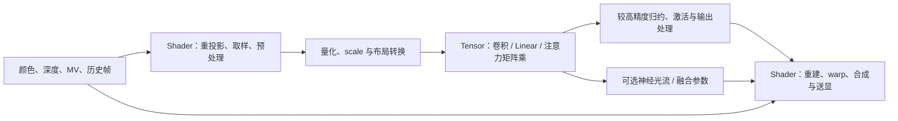

# GPU Tensor 中的 FP8：A20 Pro、超分插帧与神经图形

**A20 Pro 的 GPU FP8 提升已经有苹果发布会一手证据；但“MetalFX 超分、插帧已使用 FP8”尚没有同等明确的公开证据。** 两者必须分开。FP8 的直接用途，是降低神经网络矩阵运算的操作数精度和数据量，使更复杂的重建、去噪或生成模型进入实时预算，而不是把整条图形管线变成 8 位浮点。NVIDIA DLSS 和 AMD FSR 已证明它可以实际用于高质量超分。[^1][^8][^10]

对移动 GPU 设计，更重要的问题不是“要不要一个 FP8 勾选项”，而是：**哪些层真正执行 FP8×FP8、在哪里缩放和转换、累加用什么精度、转换后的数据能否留在片上，以及画质和总帧时间改善多少。** 本文资料截止 2026-09-10；发布宣称、源码行为、数学算例和设计建议分别标明。

## 1. A20 Pro 发布核实：FP8 提升指向哪里

### 1.1 官方发布会的具体证据

2026-09-09 苹果发布会介绍 A20 Pro GPU 时，顺序如下，时间取自官方回放字幕：[^1]

| 回放位置 | 官方内容 | 能证明什么 |
| --- | --- | --- |
| 14:45–14:59 | 新 GPU 面向图形渲染和图像生成，采用 7 核设计 | GPU 不只承担传统 graphics |
| 15:03–15:13 | 提高内部带宽、优化高端游戏，并更新 Neural Accelerators | 这里讨论的是 GPU 内的神经加速能力 |
| 15:13–15:16 | “2x faster 8-bit floating-point math” | 明确的 FP8 算术性能提升宣称 |
| 15:17–15:22 | 举例：本地运行第三方 LLM | 苹果直接点名的 FP8 邻近应用是通用设备端 AI |
| 15:23 之后 | 转而介绍独立 Neural Engine | 不能把 GPU FP8 与 Neural Engine 的翻倍混为一谈 |

一键核查：[官方视频流，从约 15:09 开始观看](https://events-delivery.apple.com/7297ElpSMNn2LZPPl9vkFV7w9WXbjB5s/m3u8/vod_main_JeyvV5ESJWYBatM.m3u8#t=909)；若播放器不支持时间跳转，打开 [Apple Event 页面](https://www.apple.com/apple-events/)并手动定位；[官方字幕片段](https://events-delivery.apple.com/7297ElpSMNn2LZPPl9vkFV7w9WXbjB5s/vod/vod_main_JeyvV5ESJWYBatM/cc/en/en_1.webvtt)可以直接搜索该句。

苹果新闻稿确认 7 核 GPU 和相对 A19 Pro 增加 50% 的内存带宽，但没有给出 FP8 绝对 TFLOPS。**不能把发布会的 2× 写成“同一 A20 Pro 上 FP8 必然为 FP16 的 2×”，也不能反推每核每周期 MAC 数。** 该段未交代具体格式、累加精度、dense/sparse 口径及测试矩阵形状。它也不是“A20 Pro 首次支持 FP8”的证明。[^2]

### 1.2 与 MetalFX 的关系：适用不等于已部署

Apple 的技术演讲确认 MetalFX 时间超分和去噪使用 ML；WWDC26 进一步展示 MetalFX Denoising、神经 tone mapper，以及 shader 内小型网络。另一场演讲公开 FP8/MXFP8 张量接口。这构成了“算法需求 + 可用软件接口”的证据链，但尚缺 MetalFX 特定版本、特定设备的逐层精度或编译产物证明。[^3][^4][^5]

因此本报告采用以下结论：

- **已确认：**A20 Pro GPU 新版 Neural Accelerators 提升 FP8 运算；Metal TensorOps 能接收公开的低精度浮点张量。
- **有合理用途：**超分、去噪、插帧中的可量化卷积、Linear、注意力矩阵乘、神经光流及融合网络。
- **未确认：**A20 Pro 上 MetalFX 的具体 FP8 覆盖率、精度格式、网络结构、每帧 MAC、实际时延及功耗。

不能因为 MetalFX 在较老 GPU 上也可运行，就否认新芯片加速的价值；也不能因为新芯片支持 FP8，就认定旧算法或所有新算法自动切换到 FP8。

## 2. FP8、INT8、MXFP8 各解决什么问题

### 2.1 FP8 的核心是“用更少的有效数字，覆盖不同数量级”

INT8 通常把一个范围均匀切成整数刻度；FP8 则为每个数保留指数，数值越大，刻度越粗。二者都是 8 位，但误差分布不同。下表 FP8 采用 2022 年原始论文的编码，不泛指所有带 FP8 名称的变体。[^6]

| 格式 | 有效数值特点 | 常见适用方向 | 关键限制 |
| --- | --- | --- | --- |
| INT8 + scale | 同一量化组内近似固定绝对步长 | 分布可校准、QAT 充分的推理网络 | 离群值可能拉大整组步长 |
| E4M3 | 1 符号 + 4 指数 + 3 尾数；最大有限值 448 | 权重、激活、前向推理 | 只有少量有效数字，仍需要缩放 |
| E5M2 | 1 符号 + 5 指数 + 2 尾数；最大有限值 57,344 | 动态范围较宽的梯度等 | 比 E4M3 更粗，不是图像推理默认更优选项 |
| MXFP8 | 一组 FP8 元素再共享一个块 scale | 局部动态范围不同的张量 | scale 粒度、布局和转换有开销 |
| FP16/BF16 | 更多位用于尾数或指数 | 敏感层、部分中间结果 | 操作数存储通常是 FP8 的两倍 |

E4M3 在 [1,2) 内相邻数间隔是 0.125；E5M2 是 0.25。它们不是 8 位 RGB，也不意味着屏幕只有 256 种颜色。FP8 常用于内部 feature/weight，最终颜色、深度、坐标和显示格式可以保持完全不同的精度。

### 2.2 指数不能替代缩放，输入精度也不等于累加精度

一个便于理解的量化定义是：

$$
q_x=\operatorname{round}_{FP8}(x/s_x),\qquad \hat{x}=s_xq_x.
$$

这里的 scale 是“解码乘数”；某些库保存它的倒数，比较接口时先统一定义。FP8 输入矩阵的运算可表达为：

$$
Y_{ij}\approx s_As_B\sum_k q_{A,ik}q_{B,kj}.
$$

上式仅适用于可提出求和的 scale。若 scale 沿 K 方向逐块变化，则必须按块施加对应的 scale 乘积再组合，不能在全部点积结束后随意乘一个全局值。累加通常采用更宽精度；**“FP8 Tensor 运算”不等于每次加法都舍入到 FP8**。具体内部部分和的位宽、截断频率和输出格式仍要查对应硬件。[^6][^7]

动态 scale 可以由当前张量的 amax 求得，也可以沿用历史统计。前者有 reduction、转换或额外访问成本，后者在突然变化的数据上有失配风险；这些都是需要评估的方案，而非免费的格式属性。对于插帧和时间超分，镜头切换、曝光骤变及稀疏高光是特别值得测试的边界。

### 2.3 MXFP8 的实际存储不是恰好 8 bit/值

Apple WWDC26 示例采用每 32 个元素共享一个 E8M0 scale 的布局。按此计算，32 个值加一个 scale 字节，共 33 字节，平均 **8.25 bit/值**；相对 FP16 的理想压缩比为 **64/33 ≈ 1.939×**，未计对齐、padding 和对象元数据。E8M0 是共享缩放编码，不是另一种有符号 feature 元素格式。[^4][^7]

块量化还影响转置：若矩阵转置改变 reduction 方向，原来的组不再沿需要的方向连续。NVIDIA 的 MXFP8 实现说明了这种情况可能需要从高精度数据分别生成两种布局。不能把普通 FP8 的逐元素转置成本直接套到所有 MXFP8 算法。[^7]

## 3. 超分与插帧：FP8 加速哪一段

以下是可用于设计讨论的通用功能图，不是 Apple MetalFX 的已公开内部网络：



| 环节 | FP8 的可能作用 | 不能由 FP8 峰值推出的收益 |
| --- | --- | --- |
| 超分 CNN | 低精度卷积提取、融合时空特征 | 不是双线性取样本身加速 |
| Transformer 超分/去噪 | Q/K/V 投影、QKᵀ、AV、MLP | softmax、归约、取样并非全部适合 FP8 |
| 插帧融合网络 | 判断候选可信度、预测融合或修正参数 | 不等于引擎 MV、depth 全部降到 FP8 |
| learned optical flow | 加速特征、相关性及更新网络中的矩阵工作 | 不意味着所有光流算法都是神经网络 |
| 块匹配光流 | 不是其 SAD/min/搜索的天然主算子 | FP8 不能自动代替 Motion Engine |
| warp、遮挡处理、UI、pacing | 主要依赖取样、逻辑、调度 | 通常不会按 Tensor 峰值同比提速 |

### 3.1 超分：让更有能力的模型进入帧预算

神经超分不是把低分辨率图像简单放大，而是利用当前采样、运动和历史信息，推断应保留的细节与应拒绝的历史数据。FP8 的收益可以用来减少同一网络耗时，也可以换取更多通道、更多层或更大的特征交互范围。**FP8 本身不创造画质；网络设计、训练和数据决定能否把节省下来的预算变成画质。**

Transformer 的主要矩阵算子为：

$$
Q=XW_Q,\quad K=XW_K,\quad V=XW_V,\quad
O=\operatorname{softmax}(QK^T/\sqrt d)V.
$$

Q/K/V 和 MLP 具有规则乘加结构，适合 Tensor 路径。softmax 和归一化会放大某些数值误差，宜单独评估精度；局部 attention、分块和融合可以改变真实成本。不能据“vision transformer”就假定厂商在整幅图上执行一个巨大的全局 N² 注意力矩阵。

### 3.2 插帧：神经网络只占完整链路的一部分

Arm NFRU 提供一个公开可检查的分工：光流参考算法与可训练 CNN 分开；CNN 从重采样候选及上下文预测四路颜色融合权重，最终图像由 shader 合成。官方 2026 年 7 月演讲描述 INT8 网络。因此，把这个网络迁移到 FP8 是一种**待训练和验证的方案**，不是现有 Arm FP8 产品证据。[^14][^15]

在这类架构中，FP8 最直接影响 CNN。若光流换成 learned flow，更多运动估计工作也可迁移到 Tensor，但窗口取样、遮挡和 warp 不会消失。NVIDIA DLSS 4 披露了神经光流路线；其 FP8 明确说明集中在 Transformer 重建部分，不能把相关文字自动扩展成所有帧生成网络都使用 FP8。[^9]

### 3.3 为什么不能顺手把 motion/depth 都改成 FP8

**工程反例：**E4M3 在 [128,256) 的间隔为 16。若不做更合适的局部编码，直接存以像素为单位的运动值，128 与 129 会难以区分，远不足以保持亚像素定位。统一乘以一个 2 的幂可改变覆盖范围，却不能增加有效数字。

实际方案可以使用较高精度坐标、局部基准加残差、专门的定点编码或另设 scale。深度遮挡比较、微小位移与最终 HDR 累积都应分别选精度；**内部 feature 可用 FP8，不意味着几何状态可接受同样误差。**

## 4. 竞品已经把 FP8 用在哪里

| 平台/技术 | 直接证据 | 证据边界 |
| --- | --- | --- |
| Apple A20 Pro | GPU 新版 Neural Accelerators 的 FP8 算术提升；举例第三方 LLM | 尚无 MetalFX 逐层 FP8 公开证明 |
| NVIDIA DLSS 4.5 SR | 官方明确用 FP8 提高 RTX 40/50 推理吞吐 | 不是整机 FPS 翻倍，也不是所有 DLSS 子功能精度相同 |
| NVIDIA DLSS 4 RR | 官方研究说明 FP8 训练与推理、融合与片上数据优化 | 不公开完整可复算网络或逐层格式 |
| AMD FSR 4 / RDNA 4 | 官方明确使用硬件 FP8 WMMA 超分 | 2025 首发兼容范围不能充当 2026 最新范围 |
| NVIDIA RTXNTC | 开源 shader 显式 FP8 输入/权重，混合精度输出链 | 属神经纹理解压，不是 DLSS 源码 |
| Arm Mali G2-Ultra NX | 架构材料标注 INT8/INT16；NFRU 演讲为 INT8 | 不因 Arm 参与 FP8 论文就推断该 GPU 已支持 FP8 |
| Qualcomm Neural Fusion | GPU Matrix Cores、HPM、超分与帧生成 | 2026-09-02 材料没有确认 FP8 格式或吞吐 |

### 4.1 NVIDIA：FP8 的价值不只是“同一模型快一点”

DLSS 4.5 Super Resolution 是最直接的应用例子。NVIDIA 2026-01-06 官方说明：第二代 Transformer 利用 RTX 40/50 的 FP8 能力提高推理吞吐；RTX 20/30 缺少原生 FP8，较重模型的性能代价更大。新模型也改变了重建和训练方式，因此不能把画质改善单独归因于 FP8。[^8]

DLSS 4 的研究说明把 FP8 与 CUDA kernel、层间融合、片上驻留一起讨论，明确涉及 Transformer Ray Reconstruction 的训练和推理。它证明的是**算法、数值格式与 kernel 共同设计**，不是仅把模型文件 dtype 改名。该资料是 NVIDIA 官方技术说明，不应冒称为经过独立同行评审的性能研究。[^9]

### 4.2 AMD：FP8 是一条实现路线，不是超分算法的必要条件

AMD 在 2025-02-28 RDNA 4 发布稿中明确指出，FSR 4 使用 FP8 WMMA。这比“芯片有 FP8、软件有 AI”更强，因为官方直接连接了应用和算子。[^10]

但 2026-06-24 的 FSR SDK 2.3 又正式把 FSR Upscaling 4.1.1 扩展至 RDNA 3 RX 7000，并将其与 RDNA 4 的画质对照展示。因此不能继续笼统声称“现代 FSR 超分只能在 RDNA 4 运行”。这份更新说明没有逐层列出精度，本文不把社区 INT8 移植或撤回过的源码当成当前官方实现的精确描述。[^11]

AMD 公开 WMMA 优化文章还显示，低位宽输入如果没有配套合适的向量加载和 K 分块，未必用满数据通路。FP8 减少字节数与实际带宽效率是两件事；不能假定同一个 FP16 kernel 换类型后便有理想收益。[^12]

### 4.3 Arm 与高通：保留 INT8 路线的合理性

Arm 的 NX 发布及 NFRU 演讲支持 INT8 路线的现实性。FP8 原始格式论文包含 Arm 作者，证明其参与数值格式研究，**不证明某一代 Mali 的 ISA、吞吐或部署模型**。[^6][^14][^15]

高通 Neural Fusion 的官方发布重点是 GPU Matrix Cores 与 18 MB HPM，把 AI 留在图形子系统；没有公布 FP8。不能把 Hexagon NPU 的规格、旧论文或竞品配置移植到新 Adreno。[^16]

高通 AI Research 的 2023 年论文则提供重要反方论证：推理中 INT8 经量化训练后可有竞争力，且浮点的指数处理和累加结构可能带来额外面积/能耗。该文的模型、格式和硬件分析有明确年代与假设，不是 A20 Pro 或 2026 年 GPU 的实测 PPA，也不应把其中比例当成通用工艺常数。[^17]

## 5. Apple 软件与 MLX 源码：最容易误判的三层含义

### 5.1 TensorOps 的低精度接口

WWDC26《Optimize custom machine learning operations with Metal tensors》给出可直接阅读的代码与时间点：[^4]

| 时间/代码入口 | 公开行为 | 芯片工程含义 |
| --- | --- | --- |
| [3:53](https://developer.apple.com/videos/play/wwdc2026/330/?time=233) | 创建 E4M3 类型 MTLTensor | 能表达低位宽元素存储 |
| [4:48](https://developer.apple.com/videos/play/wwdc2026/330/?time=288) | 添加 E8M0 scale plane，块尺寸 32×1 | scale 是独立的数据与寻址需求 |
| [6:07](https://developer.apple.com/videos/play/wwdc2026/330/?time=367) | 在 MSL 中声明 MXFP8 tensor | 可将量化数据交给底层实现 |
| [7:19](https://developer.apple.com/videos/play/wwdc2026/330/?time=439) | 分块并调用 matmul2d | TensorOps 处理量化输入与解码 |
| [9:31 起](https://developer.apple.com/videos/play/wwdc2026/330/?time=571) | cooperative tensor、归约和 attention 融合 | 减少中间结果的存储往返 |

“原生支持张量类型”属于 API 能力；它并不逐代保证底层执行相同的 FP8 乘法阵列。Apple 的 M5/A19 技术演讲明确说明，TensorOps 在旧 GPU 可以回退到 shader 实现。较早的 Feature Set PDF 也不能补造刚发布 A20 Pro 的细节。[^3]

### 5.2 MLX：一条叫 MXFP8 的路径仍先解码到 BF16

固定 Apple MLX 快照 `81ba1c6a0e50a9268b931579c2d4f1158b9aab5a`（2026-09-10）。下述结论针对该实现分支，不代表所有 MLX kernel，更不代表 MetalFX：[^18]

1. kernel 实例化把 `mxfp8` 与 `group_size=32, bits=8` 配对。
2. `fp_qmm_t_nax` 默认 `Wtype=bfloat`，权重 loader 将 FP8 和 scale 解码到 threadgroup 的 `Wtype` 存储。
3. 随后加载解码后的权重 tile 与 T 类型激活 tile，调用 NAX 矩阵路径；显式结果 tile 类型为 float。
4. dispatch 还取决于系统、设备能力、形状与对齐，不是看到模式名就必选某个硬件路径。

对应的一键代码链接：

- [模式实例化：32 元素块、8 位](https://github.com/ml-explore/mlx/blob/81ba1c6a0e50a9268b931579c2d4f1158b9aab5a/mlx/backend/metal/kernels/fp_quantized_nax.metal#L97)
- [解码函数与 threadgroup 写入](https://github.com/ml-explore/mlx/blob/81ba1c6a0e50a9268b931579c2d4f1158b9aab5a/mlx/backend/metal/kernels/fp_quantized_nax.h#L63)
- [float 结果 tile 与矩阵调用](https://github.com/ml-explore/mlx/blob/81ba1c6a0e50a9268b931579c2d4f1158b9aab5a/mlx/backend/metal/kernels/fp_quantized_nax.h#L278)
- [kernel 默认 Wtype](https://github.com/ml-explore/mlx/blob/81ba1c6a0e50a9268b931579c2d4f1158b9aab5a/mlx/backend/metal/kernels/fp_quantized_nax.h#L553)
- [主机 dispatch 条件](https://github.com/ml-explore/mlx/blob/81ba1c6a0e50a9268b931579c2d4f1158b9aab5a/mlx/backend/metal/quantized.cpp#L1045)

所以至少要分清三件事：**FP8 文件/权重存储、API 接收 FP8、实际 FP8×FP8 算术**。这条源码证明前两者不能自动推出第三者；它不否认 A20 Pro 的新硬件。底层 MPP 最终指令仍需目标机编译和 profiling 才能定论。

## 6. NVIDIA 开源反例：真正的 FP8 算子也不必整网 FP8

RTXNTC 是神经纹理压缩/解压。Inference on Sample 在 pixel/ray shader 的纹理使用位置运行小网络，重建需要的材质 texel，而不是先把全部纹理解压成大图。它展示了 FP8 Tensor 在超分插帧之外的 GPU 用途：**用实时神经计算交换纹理存储及访问成本**。这有实际计算开销，不能理解成免费的新 ASTC 格式。[^19]

固定 RTXNTC-Library `35ec039503ef5e151c661beccc82390948dd5218`（2026-08-03，v0.10.0 Beta），其 [InferenceCoopVec.hlsli](https://github.com/NVIDIA-RTX/RTXNTC-Library/blob/35ec039503ef5e151c661beccc82390948dd5218/include/libntc/shaders/InferenceCoopVec.hlsli#L215)提供明确的算子证据：[^20]

| 源码位置 | 精度/操作 | 结论 |
| --- | --- | --- |
| 215–255 行，普通 FP8 层 | 输入与权重解释为 E4M3；bias、返回值为 FP16 | 不是只有 FP8 文件，算子接口也请求 FP8 |
| 258–272 行 | FP16 中间值上执行激活处理 | FP8 算术可与较高精度非线性混合 |
| 276–310 行，输出层 | 名称仍带 FP8，却调用 INT8 乘加助手，再施加 float scale | 不能依据函数/模型名称宣称全网 FP8 |
| 313–362 行 | 连接输入层、隐藏层和独立输出层 | 精度策略按层组织 |

这一实例尤其适合自研 GPU：可以提供高吞吐 FP8 中间层，同时保留 INT8、FP16/FP32 输出和转换能力。源码请求的返回类型并不揭示硬件内部每级累加器的物理位宽。

## 7. 算力、存储和帧时间：可以复算的预算

### 7.1 换格式不会减少网络的数学 MAC 数

以前述 Arm NFRU 固定参考 CNN 为工作负载代理：1080p 颜色、480×270 网络输入，16 个卷积共 **6.3120384 GMAC/生成帧**，103,232 个卷积权重。详细逐层计算见 [Motion Engine 专题](../motion-engine/Motion-Engine专题：Arm光流加速、计算量与硬件取舍.md#42-cnn约-6312-gmac生成帧)及其脚本。这不是 Apple 的网络，也不是 FP8 已部署模型。[^15]

保持网络拓扑不变，FP16、INT8、FP8 的数学 MAC 数相同，改变的是执行速率、误差和数据量。若按 1 MAC = 2 ops 计数，才可转换成 12.6240768 Gops；不得直接把 GMAC 写成相同数值的 GFLOPS。更不能把 SAD 绝对差计数加进来，拼成一个所谓 AI TOPS。

卷积还存在形状问题：例如 3×3、16→32 通道、480×270 输出，对应逻辑 GEMM 的 M=129,600、N=32、K=144（未计边界处理）。M 很大，但 N 窄、K 有尾部；是否匹配 Tensor tile、是否需要 padding 或显式 im2col，将影响有效利用率。这只是映射分析，不预设 A20 Pro 的 tile 尺寸。

### 7.2 FP8 对 activation 的意义可能大于对小网络权重的意义

以下只计逻辑张量字节，MB 为十进制；MXFP8 按每 32 值加一个 scale 字节，忽略物理对齐及布局：

| 数据 | FP16 | FP8 元素 payload | MXFP8 元素 + scale |
| --- | --- | --- | --- |
| 480×270×32 activation | 8.2944 MB | 4.1472 MB | 4.2768 MB |
| 103,232 个卷积权重 | 206,464 B | 103,232 B | 106,458 B |

如果只压缩权重，activation 仍用 16 位写回，大图网络的流量不一定减少很多。反之，若 activation 也低位宽传递，收益会更广，但要重新检查精度、scale 和融合。FP32 累加结果、历史帧、RGBA surface、depth/MV 以及转换临时量不会自动减半。

这些表格不是 SRAM 需求、峰值内存或片外带宽实测。缓存命中与 tiling 可能使逻辑张量不落 DRAM；多余转换也可能使实际流量更高。应分别测量片上存储和外存访问。

### 7.3 神经路径 2×，并不等于整帧 2×

**假设算例：**若仅可加速的神经路径加快 r 倍，占原总时间比例 p，新增转换/调度开销为原总时间的 δ，则：

$$
S=\frac{1}{(1-p)+p/r+\delta}.
$$

当 r=2、δ=0，p 为 25%/50%/75% 时，总加速分别仅为 **1.143×/1.333×/1.600×**。原来 CNN 2 ms、其他环节 2 ms；CNN 变成 1 ms，但新增转换 0.2 ms，最终是 4/3.2=**1.25×**。这些是串行分解示例，不是 A20 Pro 预测；实际异步重叠需要从关键路径分析。

可持续有效吞吐还可粗写成峰值 × 利用率，但利用率取决于形状、访存、温控、资源争用和占用。FP8 乘法器理论更快时，瓶颈可能转移到 scale reduction、texture、寄存器、片上带宽或送显。

## 8. 为什么 FP8 不是必然优于 INT8

### 8.1 两个可复算的数值例子

附带 [precision_budget.py](precision_budget.py)用标准库枚举 E4M3 有限值，对 FP8 和对称 INT8 都采用相同的 amax 缩放原则，再比较重建误差。没有神经网络、真实图像或训练，仅用于说明分布影响。

| 人工输入分布 | INT8 MSE | E4M3 MSE | 解释 |
| --- | --- | --- | --- |
| −1 至 1，步长 0.001 | 5.1641×10⁻⁶ | 2.1681×10⁻⁴ | 有界均匀分布中，INT8 的均匀刻度更细 |
| 0.001…0.031，再加一个 64 | 3.2550×10⁻⁴ | 2.1753×10⁻⁷ | 同组离群值使 INT8 的 31 个小值全部归零；FP8 保留数量级 |

第二行不是实际 activation 统计；换成 per-channel/group INT8、clipping、均衡或 QAT，结果会改变。模型输出也不只由单层 MSE 决定。这两例只反驳“同样 8 位就一样”和“FP8 对任何模型都更准”两种误解。

### 8.2 图像重建中特别要关注时间误差

建议对量化网络检查：细线与栅栏、文本和 UI 边缘、暗部小信号、HDR 高光、透明与反射、快速移动、遮挡揭露、曝光变化和镜头切换。逐帧 PSNR/SSIM 之外，还需比较时间闪烁、拖影、warp 后残差，以及在可靠运动和遮挡掩码约束下的误差统计。

量化误差若改变历史权重或遮挡判断，即使单帧很小，也可能影响之后多帧。另一方面，粗暴提高所有层精度也可能浪费预算。合理顺序是先建立较高精度基线，再逐层量化、量测，找出需要保留较高精度的层和状态。

### 8.3 硬件为什么不只保留 INT8

INT8 的整数乘积与宽定点累加容易高效实现；FP8 则需要处理指数、符号、有效数相乘、部分和对齐与转换。具体 MAC 单元可以共享部分数据通路，也可以分开优化。**FP8 并非同面积 INT8 的无条件升级。**[^17]

但 GPU 面向的模型更开放：LLM、diffusion、vision transformer、重建网络与 shader 小型 MLP 可能共用同一组资源。提供 FP8 的系统价值，还包括直接承接 FP8 训练/量化生态、降低某些模型迁移成本，以及适应跨数量级的 activation。是否值得增加面积，应该用目标工作负载组合评估，而非只用一个可充分 QAT 的小 CNN 决定。

## 9. 超分插帧之外：为什么 Apple 会直接举 LLM

Apple 的 M5/A19 技术演讲区分了两种瓶颈：长输入 prefill 的大矩阵工作往往更偏计算受限；单流 decode 的瘦矩阵工作往往更偏权重访问受限。因此 GPU FP8 的潜在价值分为两类：真正低精度乘加提高计算吞吐，或低位宽存储减少读取数据。二者可以同时发生，也可以只实现其一。[^3]

图像/视频生成的 diffusion transformer 也包含大量 Linear 和 attention。Hugging Face Diffusers 文档明确区分 FP8 weight-only 与动态 activation + weight 量化，并提供相关配置入口。模型仓库出现 FP8 权重，只证明发布资产的格式；还需检查 backend、设备支持、实际 kernel 和 fallback。CUDA 路径的实测数据也不能移植成 Apple GPU 性能。[^21]

Apple WWDC26 的在线训练小型 sky-probe 网络与 tone mapper 展示另一方向：把小网络直接嵌进 shader。其功能已公开，但演讲没有确认这些示例使用 FP8；本文把它们列为可评估的应用方向，而非已有 FP8 部署。[^5]

## 10. 对自研移动 GPU Tensor 的设计建议

以下为工程建议，不是 Apple 内部微架构描述。

| 设计维度 | 建议验证的能力 | 为什么重要 |
| --- | --- | --- |
| 数值模式 | E4M3、必要时 E5M2；同时保留 INT8、FP16/BF16 | 开放模型与定制小 CNN 的最优模式可能不同 |
| 累加与输出 | 明确乘法、分段和、最终累加及写回精度 | FP8×FP8 的接口不足以保证数值一致性 |
| scale 路径 | per-tensor / per-channel / block 的布局、广播、转换 | 小位宽收益可能被 scale 与重排抵消 |
| 数据复用 | activation/weights/scale 能否片上驻留、融合 | 神经图形不能只看 MAC 峰值 |
| 稀疏与峰值 | dense/sparse 分列；乘加按 1 或 2 ops 写清 | 避免跨厂商宣传数字失真 |
| 形状覆盖 | 窄通道、小 batch、卷积 halo、K 尾部、局部 attention | 图形 workload 不等于大方阵 GEMM |
| 与 shader 协同 | 纹理取样、warp、激活、量化能否高效衔接 | 模型往往只是完整 pass 的一部分 |
| 可观测性 | 统计原生低精度利用率、转换和内存流量 | API 调用成功不代表命中预期路径 |
| 电源与并发 | 游戏同时运行时 mJ/帧、带宽竞争、持续频率 | 空载峰值不足以支撑移动 PPA 决策 |

建议至少比较四套端到端方案：FP16 基线、INT8 QAT、FP8 权重存储但较高精度计算、真正 FP8 权重与激活计算；必要时再比较块缩放 FP8。允许各方案保留敏感层，但要披露覆盖率、额外转换和训练投入，不能把某方案完全优化、另一方案只做粗糙强转后下结论。

验证数据应按三层组织：

1. **算子级：**目标 Conv/GEMM/attention 形状，绝对误差、吞吐、转换和访存；查明是否 fallback。
2. **模型级：**固定权重/量化方案和输入序列，逐层误差、输出质量、时延；区分量化误差与模型差异。
3. **游戏级：**固定画质/分辨率/基础 FPS，测总帧预算、输入到显示延迟、功耗与持续温控；单独计超分和插帧成本。

## 11. 结论与复算范围

**A20 Pro 的 FP8 提升可以理解为面向通用 AI 与神经图形的一笔计算和数据预算。** 超分、去噪已有竞争对手的直接 FP8 应用证据；插帧中也存在适合 FP8 的网络部分，但不能把运动估计、几何数据和送显一并算作 FP8 收益。Apple MetalFX 的具体 FP8 部署仍需等待更细官方资料或目标设备分析。

对于已有高效 INT8 移动网络，增加 FP8 未必立刻降低成本；对于开放、变化较快的 Transformer 和生成模型，它可能带来更好的生态适配与性能选择。正确的比较对象是**完整数值路径 + 算法 + 内存 + 调度 + 画质**，而非孤立的数据类型名称。

复算命令：

```sh
python3 gpu/fp8-tensor/precision_budget.py
PYTHONDONTWRITEBYTECODE=1 python3 gpu/fp8-tensor/test_precision_budget.py
python3 gpu/motion-engine/estimate_work.py
```

脚本只模拟有限值 E4M3 的舍入及两个人工分布，计算逻辑存储和假设时延；不是 MXFP8 完整模拟器，也没有测 A20 Pro、运行 MetalFX、训练 FP8 NFRU 或提供真实画质 benchmark。源码快照固定 commit；官方网页、视频与文档可能更新，时间与版本不可省略。

## 参考资料

[^1]: Apple，2026-09-09，[Apple Event](https://www.apple.com/apple-events/)；[官方回放配置与章节](https://events-delivery.apple.com/7297ElpSMNn2LZPPl9vkFV7w9WXbjB5s/json/url.json)；[官方英文 WebVTT，10–20 分钟片段](https://events-delivery.apple.com/7297ElpSMNn2LZPPl9vkFV7w9WXbjB5s/vod/vod_main_JeyvV5ESJWYBatM/cc/en/en_1.webvtt)。重点 15:03–15:22：GPU Neural Accelerators 与 8-bit floating-point math。字幕为公开媒体资源，可下载文本核查。
[^2]: Apple，2026-09-09，[Apple debuts iPhone 18 Pro and iPhone 18 Pro Max](https://www.apple.com/newsroom/2026/09/apple-debuts-iphone-18-pro-and-iphone-18-pro-max/)，A20 Pro 一节。新闻稿不是逐格式吞吐规格书。
[^3]: Apple Developer，Tech Talks，[Accelerate your machine learning workloads with the M5 and A19 GPUs](https://developer.apple.com/videos/play/tech-talks/111432/)，查询于 2026-09-10；重点 Neural Accelerators、TensorOps fallback、prefill/decode 和 profiling。
[^4]: Apple Developer，WWDC26，[Optimize custom machine learning operations with Metal tensors](https://developer.apple.com/videos/play/wwdc2026/330/)，重点 2:25–9:31 低精度类型、scale plane 与量化 matmul；9:31 起 cooperative tensor 和 attention。
[^5]: Apple Developer，WWDC26，[Build real-time neural rendering pipelines with Metal](https://developer.apple.com/videos/play/wwdc2026/359/)，MetalFX、tone mapping、shader 小型网络；该演讲不是 MetalFX FP8 精度说明。
[^6]: Paulius Micikevicius 等，2022，[FP8 Formats for Deep Learning，v2](https://arxiv.org/abs/2209.05433v2)，第 2–3 节与表 1；NVIDIA、Arm、Intel 等研究者的原始格式论文。
[^7]: NVIDIA，[Using FP8 and FP4 with Transformer Engine](https://docs.nvidia.com/deeplearning/transformer-engine/user-guide/examples/fp8_primer.html)，查询于 2026-09-10（页面版本 2.18.0）；FP8/MXFP8、scale、转置及混合精度。补充原始研究：Bita Darvish Rouhani 等，2023，[Microscaling Data Formats for Deep Learning](https://arxiv.org/abs/2310.10537)。
[^8]: Henry Lin、Andrew Burnes / NVIDIA，2026-01-06，[NVIDIA DLSS 4.5 Delivers Major Upgrade With 2nd Gen Transformer Model For Super Resolution & 6X Dynamic Multi Frame Generation](https://www.nvidia.com/en-eu/geforce/news/dlss-4-5-dynamic-multi-frame-gen-6x-2nd-gen-transformer-super-res/)，FP8 推理吞吐及 RTX 20/30 限制段落；本文引用其格式证据，不将当时发布计划当作当前状态。
[^9]: NVIDIA Research，2025，[DLSS 4: Transforming Real-Time Graphics with AI](https://research.nvidia.com/labs/adlr/DLSS4/)，第 2 节帧生成、第 3.1 节 FP8、第 6 节融合优化；官方技术说明。
[^10]: AMD，2025-02-28，[AMD Unveils Next-Generation AMD RDNA 4 Architecture with the Launch of AMD Radeon RX 9000 Series Graphics Cards](https://ir.amd.com/news-events/press-releases/detail/1238/amd-unveils-next-generation-amd-rdna-4-architecture-with-the-launch-of-amd-radeon-rx-9000-series-graphics-cards)，ML-Powered FSR 4 Upgrade 明确列出 FP8 WMMA。
[^11]: Jason Lacroix、Alexander Blake-Davies / AMD GPUOpen，2026-06-24，[AMD FSR Upscaling 4.1 RDNA 3 Support Now Available in FSR SDK 2.3 Update](https://gpuopen.com/learn/amd-fsr-sdk-2-3-blog/)，区分超分、帧生成、Ray Regeneration 各自的版本与支持范围。
[^12]: AMD GPUOpen，[WMMA guide for AMD RDNA 4 architecture GPUs — part 2](https://gpuopen.com/learn/wmma-guide-amd-rdna-4-gpus-part-2/)，查询于 2026-09-10；重点低位宽加载与 K 分块，不将文中的特定 kernel 结果推广为一般浮点结合律。
[^14]: Deyan Lazarov / Arm，2026-09-08，[Inside the Arm Mali G2-Ultra NX GPU](https://newsroom.arm.com/blog/arm-mali-g2-ultra-nx-ai-native-mobile-graphics)，架构图标注 INT8/INT16；Josh Sowerby、Alfie Roberts / Arm，2026-07，[Mobile Neural Frame Rate Upscaling — A walkthrough](https://huggingface.co/Arm/neural-frame-rate-upscaling/blob/main/2026-neural-frame-rate-upscaling.pdf)，第 44、55 张网络量化与颜色路径。
[^15]: Arm，[Neural Graphics Model Gym，固定 b86ee99125ea01c9ec1acf471743e5eb2478414a](https://github.com/arm/neural-graphics-model-gym/tree/b86ee99125ea01c9ec1acf471743e5eb2478414a)，2026-09-08；[NFRUv1 网络](https://github.com/arm/neural-graphics-model-gym/blob/b86ee99125ea01c9ec1acf471743e5eb2478414a/src/ng_model_gym/usecases/nfru/model/nfru_v1_nn.py)、[NFRUv1Core](https://github.com/arm/neural-graphics-model-gym/blob/b86ee99125ea01c9ec1acf471743e5eb2478414a/src/ng_model_gym/usecases/nfru/model/nfru_v1.py)；计算量采用本仓库固定源码复算，不是厂商 benchmark。
[^16]: Francisco Cheng / Qualcomm，2026-09-02，[Qualcomm Adreno Neural Fusion breaks the AI-graphics tradeoff with new hardware accelerator](https://www.qualcomm.com/news/onq/2026/09/adreno-neural-fusion-ai-rendering)，GPU Matrix Cores 与 HPM；没有给出 FP8 明确规格。
[^17]: Mart van Baalen 等 / Qualcomm AI Research，2023-06-15 修订，[FP8 versus INT8 for efficient deep learning inference，v2](https://arxiv.org/abs/2303.17951v2)，第 3 节硬件与格式口径、后续 PTQ/QAT 比较；结论受其模型集和分析假设约束。
[^18]: Apple / MLX，[固定源码 81ba1c6a0e50a9268b931579c2d4f1158b9aab5a](https://github.com/ml-explore/mlx/tree/81ba1c6a0e50a9268b931579c2d4f1158b9aab5a)，2026-09-10；[量化测试](https://github.com/ml-explore/mlx/blob/81ba1c6a0e50a9268b931579c2d4f1158b9aab5a/python/tests/test_quantized.py#L109)、[NAX 可用性](https://github.com/ml-explore/mlx/blob/81ba1c6a0e50a9268b931579c2d4f1158b9aab5a/mlx/backend/metal/device.cpp#L947)，关键 kernel 链接见第 5 节。
[^19]: NVIDIA RTXNTC，[Inference on Sample 集成说明，固定 0ffc32685134c50d6bd09689112fa756052c1b8c](https://github.com/NVIDIA-RTX/RTXNTC/blob/0ffc32685134c50d6bd09689112fa756052c1b8c/docs/integration/InferenceOnSample.md)，2026-08-04 快照；逐 texel 神经解压与取样限制。
[^20]: NVIDIA RTXNTC-Library，2026-08-03，[InferenceCoopVec.hlsli，固定 35ec039503ef5e151c661beccc82390948dd5218](https://github.com/NVIDIA-RTX/RTXNTC-Library/blob/35ec039503ef5e151c661beccc82390948dd5218/include/libntc/shaders/InferenceCoopVec.hlsli#L215)，FP8 隐藏层、INT8 输出层和较高精度处理。
[^21]: Hugging Face，[Diffusers / torchao 量化文档](https://huggingface.co/docs/diffusers/quantization/torchao)，查询于 2026-09-10；Supported quantization types 区分 weight-only 与动态 activation 量化。

相关专题：[Motion Engine](../motion-engine/Motion-Engine专题：Arm光流加速、计算量与硬件取舍.md) · [Arm GPU AI 演进](../arm-ai/Arm移动GPU的AI与神经网络能力演进.md) · [Compressed Weights](../compressed-weights/GPU压缩权重：Arm与高通、NVIDIA、Apple对比.md) · [GPU 目录](../GPU调研目录.md)。
