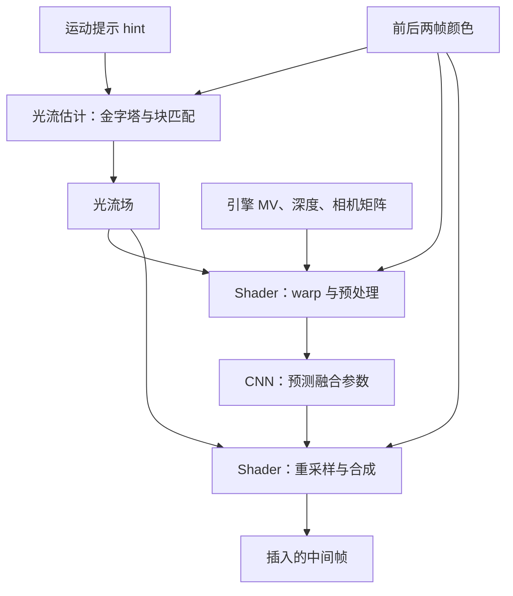

# Motion Engine 专题：Arm 光流加速、计算量与硬件取舍

Motion Engine 的任务是加速光流估计，为插帧提供两帧之间的运动对应关系。Arm 将它画在 GPU 的 Neural Accelerator 内部；官方确认了光流加速功能，开源参考实现进一步显示搜索、差值归约和运动细化等工作。**这些步骤中哪些完全固化在 Motion Engine，公开材料尚未逐项说明。** 矩阵乘加路径主要面向神经网络；应从完整计算与访存模式比较两者。[Arm 官方架构图][arm-slide]、[光流参考实现][gym-block]

面向移动 GPU 设计，核心结论有三点：**专用运动硬件的价值往往来自窗口数据复用与低延迟；NFRU 必须把光流、CNN 和 shader 分开核算；光流也可以重构为神经网络，NVIDIA DLSS 4 已给出实际反例。** 因而“有 MAC 就不需要 Motion Engine”和“光流永远不适合 MAC”都不成立。[NVIDIA DLSS 4 发布][nv-dlss4]

## 1. Arm 发布究竟确认了什么

Arm 于 2026-09-08 发布 Mali G2-Ultra NX。[发布解析][arm-release]确认 Neural Accelerator 集成在 shader core 内，复用 GPU 内存系统、一致性缓存和控制结构。配套架构图明确画出内部的 Motion Engine，并标注 optical flow acceleration。

更早的 Arm 原始演讲 [Mobile Neural Frame Rate Upscaling — A walkthrough（Josh Sowerby、Alfie Roberts，2026 年 7 月）][arm-nfru-talk]第 21 张幻灯片已明确将块匹配光流与 Motion Engine 硬件加速联系起来。因此应区分“7 月算法讲解”与“9 月 NX 产品架构发布”，不能把后者当成该术语首次公开。下文页码均指幻灯片印刷编号。

图中还列出 INT8/INT16、whole tensor operations、压缩权重以及最高 2× GPU clock。这些是 **Neural Accelerator 整体的宣传规格**；不能据此认定 Motion Engine 的每条数据通路都是 INT8/INT16，也不能把时钟说明直接变成独立光流吞吐。官方没有披露 SAD lane 数、阵列尺寸、SRAM 容量/端口、每周期候选数或面积。

功能层级应这样理解：

| 名称 | 对应内容 | 不应混淆的对象 |
| --- | --- | --- |
| 游戏引擎 Motion Vector | 从相机、几何和动画变换得到的屏幕空间运动 | 从图像搜索出来的光流 |
| Motion Engine | Arm 明确标注的光流硬件加速功能 | 完整帧生成算法 |
| Neural Accelerator | 包含神经处理及 Motion Engine 的整体模块 | 单一 MAC 阵列 |
| NFRU | 光流、引擎数据、CNN、warp 与合成的完整插帧技术 | Motion Engine 的另一个名字 |

几何运动矢量可以很准确，但对反射、高光或某些屏幕空间效果未必表达正确的视觉运动；图像光流可以补充这类信息，也会受到遮挡、重复纹理和亮度变化影响。两种信息需要经过可信度判断与融合。[NVIDIA DLSS 4 技术论文/说明][nv-paper]

## 2. 三套 Arm 开源材料，各自能证明什么

以下分析固定源码版本，避免 main 分支更新后无法复查。链接均指向该版本。

| 材料与快照 | 可以核查的内容 | 不能据此直接确定 |
| --- | --- | --- |
| [Model Gym][gym-root]，`b86ee99125ea01c9ec1acf471743e5eb2478414a` | NFRU 参考算法、网络层、训练与计算量 | 原生芯片周期数/PPA |
| [Neural Graphics SDK][sdk-root]，`aba0d109ffcfb97e380ac0a68fb11683e5561c6e` | 游戏集成、分辨率策略、hint、shader/graph 调度 | 编译后网络与参考网络逐操作等价 |
| [Vulkan ML Emulation Layer][emu-root]，`24e7eec111cf52e50ad4a46d7da2b6579dd1113a` | 用 Vulkan compute 模拟光流的可读实现 | Motion Engine 的 RTL、物理资源划分 |

特别值得读的是模拟器的 [block_match_of.comp][emu-block]。它不仅有 5×5 块和最大半径 3，还出现了明确注释：

> “Spiral pattern as traversed in Motion Engine”

这让软件搜索顺序与 Motion Engine 有了直接的一手联系。不过，shader 中的 FP16、texture fetch、workgroup 大小和中间 buffer 布局，仍是模拟实现选择；不能逐项解释成芯片内部电路。

## 3. NFRU 的真实计算链

下面是功能依赖图，不是芯片物理 floorplan，也不表示所有节点都能并发。



[Model Gym 的 NFRUv1Core][gym-core]分别创建 `BlockMatchV321` 和 `NFRUAutoEncoder`；`get_neural_network()` 只返回 autoencoder。光流在 `_resolve_flow()` 中计算，并处于 `torch.no_grad()` 下；后续才执行 warp、preprocess、CNN 和 postprocess。这明确区分了参考运动估计和可训练网络。

这套参考代码还把光流放在生成时间点循环之外：**同一帧对的光流可复用，CNN/合成按生成时间点执行。** 因此从一张插帧改成多张插帧，不能把所有成本一起乘倍数；这也不等于已经测得原生硬件多帧吞吐。

### 3.1 默认光流算法，具体做了什么

[BlockMatchV321][gym-block]与[常量定义][gym-constants]给出以下参考配置：

- 两张 RGB 图先转亮度，再建立六层图像金字塔。
- 默认 5×5 模板、搜索半径 3，即每个位置最多 7×7 = 49 个局部候选。
- 金字塔逆序，从最粗层开始；只做到 `last_bm_level=2`，随后退出。
- 在更细层放大上一层位移并 warp 搜索图，再找局部残差运动。
- 最后一个匹配尺度增加一个 hint 候选；比较代价后决定是否采用。
- 后续包括 Lucas–Kanade 风格亚像素细化、3×3 中值滤波和联合双边滤波；fast 档可跳过双边滤波。

所以“六层金字塔”不等于“六层都做完整块匹配”。默认实际匹配的是原图的约 1/32、1/16、1/8、1/4 宽高四个尺度。半径 3 也不是原图只能追踪 3 像素运动：粗到细传播与 warp 改变了搜索中心。

参考匹配代价是 SAD：

$$
E_p(d)=\sum_{q\in W_p}|I_0(q)-I_1(q+d)|,\qquad
d^*(p)=\operatorname*{argmin}_{d}E_p(d).
$$

核心是逐候选计算像素差值、累加并选最小值。参考算法的亚像素和滤波阶段会用乘加；它们是否由 Motion Engine、共享算术路径或 shader 执行尚未公开，因此不能断言 Motion Engine 内部有或没有乘法器。

### 3.2 CNN 的 16 个输入通道和 4 个输出，实际含义是什么

[预处理源码][gym-preprocess]构造四张候选 RGB：前帧/后帧各自按引擎 MV 重采样，以及前帧/后帧各自按光流重采样。这给出 4×3=12 通道，再加两路归一化深度和两路遮挡揭露特征，合计 16 通道。**MV/flow 首先用于取样坐标，并非把其 x/y 分量直接拼进这 16 通道。**

[后处理源码][gym-postprocess]对 CNN 的四路输出插值并做 softmax，得到四张候选 RGB 的融合权重，随后合成为输出图像。该版本 CNN 既不直接输出 RGB，也不直接预测一个新的二维光流场。这个分工解释了为什么已有神经加速器，仍需要运动估计和纹理取样路径。

Arm 演讲第 25 张也特别强调：**不是先混合 MV 与 OF 矢量，而是分别生成颜色候选，再融合颜色。** 第 31–35、51–53 张说明另一项关键优化：低分辨率 scatter 运动、按深度补洞，再在高分辨率 gather 颜色；不把完整颜色都用原子操作向前散射。这里涉及纹理访问、深度竞争和整数原子操作，不能纳入 CNN MAC 数，更不能全部归给 Motion Engine。[原始演讲][arm-nfru-talk]

源码还揭示了演讲与版本实现的差异：演讲第 51 张画出 12-bit depth + 4-bit 共享指数 + 两个符号位 + 两个 7-bit 尾数，共 32 位；但本报告固定 SDK 的 [quant.h][sdk-quant]实际使用 `31−14−2−4=11` 位深度，并清除最高位。其 [GLSL 回调][sdk-atomic]使用 `imageAtomicMax`，一次竞争同时保留胜出深度及关联运动。**这是 shader 中间数据的打包策略，不是 Motion Engine 内部精度规格。** 位宽评估应以对应版本源码为准。

### 3.3 SDK 的 hint 与参考模型不可混称

参考模型接收数据集提供的运动提示；当前 [SDK hint shader][sdk-hint]则用前帧深度和前后相机投影矩阵重投影，构造相机运动提示。代码明确说明，这种方法对动画物体会失效。因此这里的 hint 不能称为“包含全部物体运动的游戏引擎 MV”。引擎 MV 仍在 NFRU 其他步骤使用。

[SDK opticalflow][sdk-of]绑定两帧颜色、hint 和输出 flow；这条路径不请求 cost 输出。后端通过 [Vulkan optical-flow pipeline][sdk-vk]创建独立光流图，而帧插值组件分别建立 preprocess shader、interpolation data graph、postprocess shader。[NFRU runtime][sdk-fi]

这里“不请求 cost”只指不向应用输出 cost map。模拟器在启用 hint 时仍计算内部匹配代价，以比较 hint 和搜索结果。[makeReplaceWithMvInput][emu-of]中可以直接看到 RAW_SAD 和 MVReplace。网格默认优先选设备支持的 4×4，其次 8×8、2×2、1×1；网格表示输出矢量密度，不能直接解释为硬件模板尺寸。[SDK 默认网格选择][sdk-of]

## 4. 计算量：先确定分辨率和计数单位

以下是对固定 Model Gym 源码的**静态稠密计算量估算，不是 Arm 硬件 benchmark**。假设 batch=1、默认半径 3、启用 hint、每帧对生成一张中间帧；没有计算稀疏跳过、编译融合、边界零值消除或专用指令压缩。

两种单位必须分开：

- **SAD term**：一个候选模板内的一次像素绝对差评估；完整实现还要累加、比较和选索引。
- **MAC**：一次乘法并累加。只有说明口径时，才可按 1 MAC = 2 arithmetic operations 转换。

不能将 SAD term 与 MAC 直接相加，得到一个有意义的“整机 TOPS”。

### 4.1 1080p 光流：约 2.145 亿 SAD terms/帧对

输入颜色为 1920×1080；奇数尺寸按源码 pad-to-even，因此会出现 136、68、34。四个匹配尺度的计算如下：

| 金字塔层 | 实际参与匹配的尺寸 | 每位置候选数 | 每候选差值数 | SAD terms |
| --- | --- | --- | --- | --- |
| L5 | 60×34 | 49 | 25 | 2,499,000 |
| L4 | 120×68 | 49 | 25 | 9,996,000 |
| L3 | 240×136 | 49 | 25 | 39,984,000 |
| L2 | 480×270 | 49 + 1 hint | 25 | 162,000,000 |
| 合计 | — | — | — | **214,479,000** |

计算式为：

$$
N_{SAD}=25\left[49\sum_{l=2}^{5}W_lH_l+W_2H_2\right].
$$

最后的 hint 只增加一个候选代价，不是把已有 49 个候选全部删掉。默认以外，均值运动提示可能收缩搜索半径；实际硬件也可能采取未公开的优化。因此这里统计的是明确配置的参考工作量。[多尺度循环][gym-block]、[模拟器动态搜索逻辑][emu-of]

这里还**没有**计入建金字塔、warp、亚像素求解、中值/双边滤波、hint 生成、数据转换和 dispatch。2.145 亿既不是完整光流操作总数，也不是时延预测。

为避免把差值数误当总算术量，按逐窗口独立求和、逐位置选择展开，同一配置还对应 **205,899,840 次 SAD 归约加法**（每 25 项求和计 24 次），以及 **8,406,720 次最小值选择比较**（每 C 个候选计 C−1 次）。这只是该直接算法的基本归约计数，不是所有优化实现的下界；滑动窗口复用可改变加法数量。计数不包含 tie-break，也不等于 PyTorch 或 shader 实际指令数；绝对差本身也可能映射成一条或多条指令。

搜索半径对工作量很敏感：固定其他条件，半径 1/2/3 分别对应 **42,039,000 / 111,015,000 / 214,479,000 SAD terms**。这些是受控参数敏感性分析，不是三个厂商质量档位的性能数据；更小半径可能漏掉运动。fast 档跳过双边滤波，也不能从 SAD 数不变推断耗时不变。

### 4.2 CNN：约 6.312 GMAC/生成帧

默认 1080p 数据配置中，颜色为 1920×1080，深度/MV 为 960×540；参考光流和 CNN 输入空间尺寸为 480×270，CNN 输入通道为 16。[数据规格][gym-data]、[预处理输出形状][gym-preprocess]

逐层核对 [NFRUAutoEncoder][gym-nn] 和 [ConvBlock 默认参数][gym-conv]后，只有 `conv5` 做 stride-2 下采样。不能依据网络中残留的“540/270”注释推算所有层；应按真实参数与张量尺寸计算。

| 层/层组 | 通道与卷积核 | 输出空间尺寸 | 每生成帧 GMAC |
| --- | --- | --- | --- |
| conv1 | 16→32，3×3 | 480×270 | 0.597197 |
| conv2 | 32→16，5×5 | 480×270 | 1.658880 |
| conv3、skip1_conv、conv6 | 每层 16→16，3×3 | 480×270 | 合计 0.895795 |
| conv5 | 16→16，5×5，stride 2 | 240×135 | 0.207360 |
| conv5a、conv5b | 16→16，1×1 / 3×3 | 240×135 | 合计 0.082944 |
| conv5c/c_1/d/d_1/d_2 | 五层 16→16，7×7 | 240×135 | 合计 2.032128 |
| conv5e | 64→16，1×1 | 240×135 | 0.033178 |
| conv7 | 32→16，3×3 | 480×270 | 0.597197 |
| output_conv_mv | 16→4，5×5 | 480×270 | 0.207360 |
| 合计 | 16 个卷积 | — | **6.312038** |

每层使用 `Hout × Wout × Cin × Cout × K²`；合并后为：

$$
N_{MAC}=48,704\times W_{CNN}\times H_{CNN}.
$$

网络有 103,232 个卷积权重；加上 bias 与 BN 可训练参数共 104,004。参数少不代表空间计算少：同一组权重会在大量位置复用。上述计数不含 BN、激活、重采样、量化和 shader；也不保证部署 VGF 与参考图具有相同的执行指令数。

### 4.3 分辨率与帧率：参考模型和产品策略分开看

| 完整颜色输入 | CNN 输入 | 默认 SAD terms/帧对 | 卷积 GMAC/生成帧 |
| --- | --- | --- | --- |
| 1280×720 | 320×180 | 95,324,000 | 2.805350 |
| 1920×1080 | 480×270 | 214,479,000 | 6.312038 |
| 2560×1440 | 640×360 | 380,708,000 | 11.221402 |

此表表示**不施加 SDK 分辨率上限的参考算法缩放**。30 个真实帧/秒、每帧对插一帧，1080p 稳态约需 6.434 G SAD terms/s，以及 189.361 GMAC/s 卷积计算；60→120 时两者约翻倍。若只给 CNN 2 ms 执行预算，则要求约 3.156 TMAC/s 的有效卷积吞吐，不能用平均每秒需求代替瞬时预算。

实际 [SDK 分辨率上限][sdk-caps]明确为：光流输入颜色高 1080、MV/depth 高 540、flow 高 270、tensor 高 270。[创建逻辑][sdk-fi]按宽高比降采样，并结合设备支持的光流网格。因此 1440p/4K 显示不意味着光流和 CNN 按显示像素等比例增长；最终合成及部分图像访问仍可能随输出分辨率增长。

还有两个范围限制：上述 SAD 只计**一次配置方向的估计**，不能因为有前后两帧就自动乘 2；反过来，如果新算法明确运行双向估计，必须另加一份。多帧参数则仅用于参考源码的成本分析：[Arm NFRU 模型卡][hf-nfru]当前描述最高 2×，不能把脚本中设置三张生成帧解释成官方产品支持 4×。

### 4.4 访存可能比算术峰值更关键

以 480×270 为例，若天真地物化所有 50 个候选的 5×5 uint8 patch，需要 **162 MB**；若物化 50 个 int32 cost，则约 **25.92 MB**（本节 MB/KB 均为十进制）。这只是中间表示大小的算例，**不是 Arm 芯片的 SRAM 容量、PyTorch 峰值显存或实际 DRAM 流量**；PyTorch unfold 的浮点临时量还可能更大。硬件可流式产生候选，立即更新最小值，避免完整 cost volume 落地。

相比之下，16 通道 INT8 CNN 输入为 2.07 MB，首层 32 通道 activation 为 4.15 MB，全部卷积权重若按 INT8 存放约 103 KB。局部 tiling、halo、缓存驻留和算子融合会显著影响数据流量；需要测量每级缓存与 DRAM，不能仅凭张量尺寸相加得到带宽。

## 5. 为什么不直接用普通 MAC 单元

### 5.1 纯 MAC 阵列与通用 SIMD ALU 是不同问题

MAC 阵列擅长规则乘加：

$$
C_{ij}=\sum_k A_{ik}B_{kj}.
$$

SAD 块匹配则需要绝对差、局部求和、最小值比较、候选索引和不同位移取数。具备整数 abs/min、shuffle 与纹理访问的通用 shader 当然能实现；Arm 模拟器正是例子。但纯 MAC 阵列不能单独完成这些步骤，补充外围单元和数据搬运后，实际收益可能受限。[模拟 shader][emu-block]、[普通 compute dispatch][emu-dispatch]

对这类算法，专用硬件的潜在优势是：用小面积差值/加法电路并行比较，利用重叠窗口复用数据，边计算边保留最优候选，并降低 shader 调度与中间结果存取成本。这是基于计算模式的工程判断，尚无公开 Arm 面积/功耗数据可以量化优势。

### 5.2 数学变换不等于免费映射

若把距离改为 SSD，可展开成平方和与点积：

$$
\sum(a-b)^2=\sum a^2+\sum b^2-2\sum ab.
$$

其中点积适合 MAC，但 SAD 与 SSD 不是同一个匹配准则；仍需计算/复用范数、形成候选、取最小值并做运动细化。必须重新验证画质与代价。

若进一步改为 learned optical flow，卷积、相关性计算和特征变换可能成为主体，Tensor/MAC 加速便很合理。NVIDIA DLSS 4 已公开采用这条路线，见第 7 节。因此应比较完整的“算法 + 硬件 + 存储”方案，而不是只比较一种算子的电路。

原始研究可参考 Teed 与 Deng 的 [RAFT（ECCV 2020）][raft-paper]及[作者代码][raft-code]：用特征、全对相关体和循环更新估计光流，显示运动估计确实能重构成包含大量卷积/相关性计算的网络。但相关体容量、迭代次数和取样仍会限制性能。RAFT 用于解释计算形态，**不是 Arm NFRU 或 NVIDIA DLSS 4 的已确认网络架构**。

## 6. Motion Engine 可能怎样实现

下表是**设计假设，不是 Arm 公布的微架构**。它可用于自研方案讨论和向 IP 厂商提问。

| 可能的部件 | 服务的工作 | 需要验证的取舍 |
| --- | --- | --- |
| 分块/行缓存与地址生成 | 复用参考块、搜索窗口和 halo | SRAM banking、窗口跨度、非连续 warp 后取数 |
| SAD lanes + 加法树 | 并行计算候选代价 | 候选并行还是模板像素并行；吞吐与面积 |
| 最优候选选择与 tie-break | 输出稳定的最小代价及位置 | 重复纹理/平坦区域的确定性 |
| 插值与梯度计算 | warp、亚像素修正 | 固定功能、shader 或共享向量路径 |
| 中值/双边滤波路径 | 抑制噪声、保持运动边缘 | 固化后灵活性、精度、旁路模式 |
| 与 GPU 的共享接口 | 任务提交、缓存一致性、结果交付 | 并发能力、资源竞争、调度延迟 |

一个简单的位宽推导：uint8 的单像素绝对差最大为 255；5×5 SAD 最大 6,375，数学上 13 个无符号位可容纳。16-bit 累加器可以留出实现余量。**这不能推导 Arm 内部位宽**：图像归一化、正则项、亚像素和滤波会有其他精度需求。

普通 MAC 也可以扩展为同时支持乘加与 SAD/min 的多模式执行单元，节省部分寄存器、控制和数据通路。工程代价是额外 mux/控制、不同归约网络，以及两种工作争用吞吐。是否拆成独立引擎，要看面积、关键路径、利用率和调度，而非逻辑上绝对不能共享。这里没有假定 Arm 使用独立 systolic array 或完全独立的 SRAM。

同理，49 个相邻候选的 5×5 搜索块在一个位置上覆盖 11×11 搜索区域，而不是 49×25 个互不相同的像素。窗口缓存能利用这类重叠；跨位置、跨层与 warp 后的复用程度还取决于实际数据流。

面积决策应比较至少三种方案：增强 shader/纹理路径、专用搜索引擎、神经光流复用矩阵路径。专用路径可能降低能耗与图形资源占用，代价是固定面积和算法演进约束；神经方案可更新模型，但会争用 Tensor 吞吐和 activation 存储。

## 7. NVIDIA、高通、苹果：公开实现并不相同

| 厂商/阶段 | 官方可确认的实现 | 对 Arm Motion Engine 的比较意义 |
| --- | --- | --- |
| NVIDIA Turing/Ampere/Ada | 专用 NVOFA；Ada 将更多光流前后处理移入硬件 | 价值包含减少 compute 依赖 |
| NVIDIA DLSS 3 | OFA 估计光流，Tensor Cores 执行生成网络 | 与 Arm 的功能分工相近 |
| NVIDIA DLSS 4 | 用 AI 模型替代原来的硬件光流路径 | MAC/Tensor 可以承载重新设计的运动估计 |
| Qualcomm Adreno 6xx | accelerated texture unit 加速块匹配 | 运动硬件可以嵌在纹理路径 |
| Qualcomm AFME / Neural Fusion | 完整帧生成产品功能；后续增加 GPU Matrix Cores | 产品品牌不等于单个光流硬件块 |
| Apple MetalFX / VideoToolbox | 游戏插帧、视频光流/插帧 API | 可确认功能，专用物理模块未获充分公开证据 |

### 7.1 NVIDIA：从专用 OFA 到神经光流

[NVIDIA 2022 技术文章][nv-ada]明确：Turing/Ampere 的部分光流前后处理依赖 compute engine；Ada 将其中多数移入 NVOFA，降低依赖，官方称速度约为 Ampere 的 2×。这支持一个重要设计判断：即使已有搜索硬件，外围处理与跨引擎调度仍可能限制速度。NvOFFRUC 整体还使用 CUDA，不能说 OFA 独自生成完整插帧。

[RTX 40 官方问答][nv-qa]说明 DLSS 3 用 OFA 计算光流，再用第四代 Tensor Cores 执行神经网络。但 [DLSS 4 发布][nv-dlss4]明确改用高效 AI 模型生成光流，并改进多帧生成复用。这个变化描述的是算法执行路径，不能据此声称物理 GPU 已删除 OFA。

[NVIDIA 研究说明][nv-paper]进一步讨论跨生成帧复用中间计算与 Tensor 利用率。其性能数字涉及不同 GPU、算法与生成帧数，不能拿来与 Arm 的静态 SAD/MAC 计数做直接速度排名。

### 7.2 高通：纹理加速、AFME 与新矩阵路径

[Qualcomm 2021 官方文章][qc-me]说明，Adreno 6xx（例如 Snapdragon 865）通过加速纹理单元实现硬件块匹配，并支持层次运动搜索。[GL_QCOM_motion_estimation 规范][qc-spec]接收参考/目标亮度纹理，输出按 block 组织的运动矢量，还支持 ROI mask。这是一条具体可证的“增强纹理路径”实现，而不是从产品名称推测。

Snapdragon 8 Gen 1 发布时出现的 [Adreno Frame Motion Engine（AFME）][qc-afme]是整套帧生成能力；其“近同功耗增加帧数”的宣传口径不能作为光流块单独能效。也不能把 Adreno 6xx 的实现自动推广到所有后续 AFME。

2026-09-02 的 [Adreno Neural Fusion 发布][qc-fusion]进一步公布 GPU Matrix Cores 与 18 MB HPM，把 AI 超分、神经处理和帧生成纳入图形管线。材料尚未解释 Matrix Cores 与 AFME/光流硬件的关系，所以既不能说“已替代 AFME”，也不能断言“必有与 Arm 相同的内部 Motion Engine”。

### 7.3 苹果：公开接口充分，硬件归属仍需留白

[WWDC25 Metal 4 游戏演讲，7:17 起][apple-metal]介绍 MetalFX Frame Interpolation，使用两帧、运动和深度数据，讨论 tone mapping、UI 分离、正确送显顺序与 pacing，并建议输入至少约 30 FPS。它展示了可用的游戏集成路径，没有公开一个可与 Arm Motion Engine 对应的物理模块。

[WWDC25 VideoToolbox 演讲][apple-video]介绍 VTFrameProcessor 的光流、帧率转换和低延迟插帧，允许预先计算光流或在线计算。视频处理 API 与 MetalFX 游戏 API 应分别看待；共享 Apple Silicon 不证明它们调用同一模块，更不能默认均由 Apple Neural Engine 执行。

因此本报告对苹果的结论是“功能与接口已公开，专用 Motion Engine 拓扑缺少证据”，而不是“苹果没有运动加速硬件”。

## 8. 自研移动 GPU 应测什么

用同一批场景、相同输入分辨率、生成帧数和画质目标，比较 shader、专用搜索、神经光流三条路径。至少保留快速平移、细线、粒子、反射、透明、遮挡揭露、重复纹理和镜头切换序列；单一 EPE 均值不能代表插帧观感。

| 评估项 | 必须拆开的数据 |
| --- | --- |
| 计算 | 金字塔、SAD、亚像素、滤波、hint、CNN、warp/合成 |
| 时间 | 各阶段 GPU 时间、dispatch/sync、关键路径与输入到显示延迟 |
| 存储 | 权重、activation、flow、history、临时 surface、片外读写 |
| 资源竞争 | 与游戏 shader、texture、Tensor 和缓存的同时负载 |
| 能耗/PPA | 固定画质与 FPS 下的 mJ/帧、持续功率、面积和目标频率 |
| 软件适配 | 网格、格式、hint/cost 支持；原生还是 emulation |
| 画质 | EPE + 插帧误差 + 遮挡/边缘稳定性 + 主观视频检查 |

插帧依赖前后两张真实帧，会引入等待与显示安排问题；“输出 120 FPS”不能等同于“120 FPS 原生输入响应”。专用 Motion Engine 的作用是缩短其中的运动估计环节，而不是自动消除整条管线延迟。

Arm 7 月演讲第 13 张讲者备注使用“增加半帧延迟”的描述，但没有在该句给出完整送显时序或 frame 单位定义。不能把它扩展成所有集成固定增加半帧，也不应笼统写成固定一帧；应分别测量等待未来真实帧、算法执行、排队和送显。[演讲原稿][arm-nfru-talk]

建议向 Arm 或其他 IP 提供方追问四组参数：每周期候选/像素吞吐与支持精度；SRAM/缓存及数据格式；哪些滤波/细化硬化、哪些回到 shader；与 MAC/纹理执行资源是否共享、是否可并发。没有这些参数，不宜直接由宣传 TOPS 做 PPA 预算。

## 9. 复算、版本与证据边界

本专题对应资料截止 2026-09-09。Arm 新发布只确认功能与集成层级，没有得到独立真机光流 PPA；不同厂商的宣传比例不用于跨平台排名。Model Gym 与模拟层算法可读，公开集成 SDK 有独立分辨率策略，三者不被假定逐操作等价。

[计算脚本 estimate_work.py](estimate_work.py)仅依赖 Python 标准库，打印四尺度 SAD 工作量、16 层卷积 MAC、参数量及中间表示大小：

```sh
python3 gpu/motion-engine/estimate_work.py
python3 gpu/motion-engine/estimate_work.py --width 2560 --height 1440
python3 gpu/motion-engine/estimate_work.py --base-fps 60 --json
python3 gpu/motion-engine/estimate_work.py --search-radius 1 --no-hints
python3 gpu/motion-engine/test_estimate_work.py
```

脚本要求宽高为正整数且可被 8 整除，以保证这里分析的 CNN skip/上下采样尺寸一致；它不表示硬件只支持这些尺寸。默认输出应包含 `214479000 SAD terms/pair` 与 `6312038400 MACs/generated frame`。JSON 明确列出未统计工作和“未应用 SDK 上限”的范围。16 层通道、kernel 与唯一 stride-2 配置已与固定上游源码的 AST 交叉核对；没有在模拟器或真机运行完整 NFRU benchmark。

生态复现入口可从 [Hugging Face NFRU 模型卡][hf-nfru]开始：其中列出权重、VGF 和场景。权重/模型内容采用 Arm AI Model Community License，与 Apache-2.0 源码分开审查；模型卡与 main 资源会更新，应保存版本。模型卡中部分路线说明可能滞后于已更新源码，判断已实现能力时优先检查固定 commit。NVIDIA/高通/苹果没有在本报告引用材料中提供与 Arm 同口径的网络层及完整工作量，因而比较表保留功能/拓扑，不补造跨厂商 TOPS。

最值得依次阅读的来源如下。代码链接在第 2–4 节固定 commit，发布/演讲链接保留官方原页。

| 来源 | 发布者/时间 | 优先阅读内容 |
| --- | --- | --- |
| [G2-Ultra NX 发布解析][arm-release]、[原始架构图][arm-slide] | Arm，2026-09-08 | Motion Engine 的真实位置与公开规格 |
| [NFRU 原始演讲 PDF][arm-nfru-talk] | Arm，2026-07 | 第 21/25/31–35/51–53 张：硬件联系、颜色融合、scatter/gather、原子打包 |
| [BlockMatchV321][gym-block]、[NFRU 网络][gym-nn] | Arm，固定 2026-09-08 快照 | 搜索循环、默认层级、真实网络计算 |
| [光流模拟 shader][emu-block]、[多尺度调度][emu-of] | Arm，固定快照 | Motion Engine 注释、SAD、hint 与过滤 |
| [SDK 分辨率配置][sdk-fi]、[hint shader][sdk-hint] | Arm，固定快照 | 实际集成如何控制计算量 |
| [Optical Flow Pipeline 参数][vk-of] | Khronos，查询于 2026-09-09 | 输入/输出、网格、可选 hint/cost；接口不规定 RTL |
| [Ada 光流技术文章][nv-ada] | NVIDIA，2022-12-06 | 专用硬件与前后处理边界 |
| [DLSS 4 发布][nv-dlss4]、[研究说明][nv-paper] | NVIDIA，2025 | 神经光流替代路径与跨帧复用 |
| [Adreno 运动估计][qc-me]、[扩展规范][qc-spec] | Qualcomm/Khronos，2021/2020 | 纹理单元块匹配及接口 |
| [Adreno Neural Fusion][qc-fusion] | Qualcomm，2026-09-02 | 新 GPU Matrix Cores 与本地存储 |
| [MetalFX 插帧演讲][apple-metal]、[视频处理演讲][apple-video] | Apple，WWDC25 | 游戏与视频的功能、输入和时序约束 |
| [NFRU 模型卡][hf-nfru] | Arm，查询于 2026-09-09 | 模型参数预测、最高 2×、权重/VGF/许可证 |
| [RAFT 论文][raft-paper]、[作者代码][raft-code] | Zachary Teed、Jia Deng，2020 | 神经光流的原始研究；不代表厂商具体算法 |

相关：[Arm GPU AI 历代演进](../arm-ai/Arm移动GPU的AI与神经网络能力演进.md) · [GPU 调研目录](../GPU调研目录.md)。

[arm-release]: https://newsroom.arm.com/blog/arm-mali-g2-ultra-nx-ai-native-mobile-graphics
[arm-slide]: https://newsroom.arm.com/wp-content/uploads/2026/09/Arm-Newsroom-GPU-Tech-Day-Final-slide-23-1200x675.png
[gym-root]: https://github.com/arm/neural-graphics-model-gym/tree/b86ee99125ea01c9ec1acf471743e5eb2478414a
[gym-core]: https://github.com/arm/neural-graphics-model-gym/blob/b86ee99125ea01c9ec1acf471743e5eb2478414a/src/ng_model_gym/usecases/nfru/model/nfru_v1.py
[gym-block]: https://github.com/arm/neural-graphics-model-gym/blob/b86ee99125ea01c9ec1acf471743e5eb2478414a/src/ng_model_gym/usecases/nfru/model/optical_flow/blockmatch_v321.py
[gym-constants]: https://github.com/arm/neural-graphics-model-gym/blob/b86ee99125ea01c9ec1acf471743e5eb2478414a/src/ng_model_gym/usecases/nfru/model/constants.py
[gym-nn]: https://github.com/arm/neural-graphics-model-gym/blob/b86ee99125ea01c9ec1acf471743e5eb2478414a/src/ng_model_gym/usecases/nfru/model/nfru_v1_nn.py
[gym-conv]: https://github.com/arm/neural-graphics-model-gym/blob/b86ee99125ea01c9ec1acf471743e5eb2478414a/src/ng_model_gym/core/model/layers/conv_block.py
[gym-preprocess]: https://github.com/arm/neural-graphics-model-gym/blob/b86ee99125ea01c9ec1acf471743e5eb2478414a/src/ng_model_gym/usecases/nfru/model/torch_processing/preprocess.py
[gym-data]: https://github.com/arm/neural-graphics-model-gym/blob/b86ee99125ea01c9ec1acf471743e5eb2478414a/docs/nfru/nfru_dataset_specification.md
[sdk-root]: https://github.com/arm/neural-graphics-sdk-for-game-engines/tree/aba0d109ffcfb97e380ac0a68fb11683e5561c6e
[sdk-of]: https://github.com/arm/neural-graphics-sdk-for-game-engines/blob/aba0d109ffcfb97e380ac0a68fb11683e5561c6e/sdk/src/components/opticalflow/ffx_opticalflow.cpp
[sdk-hint]: https://github.com/arm/neural-graphics-sdk-for-game-engines/blob/aba0d109ffcfb97e380ac0a68fb11683e5561c6e/sdk/src/backends/vk/shaders/opticalflow/ffx_opticalflow_mv_hints.glsl
[sdk-vk]: https://github.com/arm/neural-graphics-sdk-for-game-engines/blob/aba0d109ffcfb97e380ac0a68fb11683e5561c6e/sdk/src/backends/vk/ffx_vk.cpp
[sdk-fi]: https://github.com/arm/neural-graphics-sdk-for-game-engines/blob/aba0d109ffcfb97e380ac0a68fb11683e5561c6e/sdk/src/components/frameinterpolation/ffx_frameinterpolation.cpp
[sdk-caps]: https://github.com/arm/neural-graphics-sdk-for-game-engines/blob/aba0d109ffcfb97e380ac0a68fb11683e5561c6e/sdk/include/FidelityFX/gpu/frameinterpolation/ffx_frameinterpolation_resources.h
[emu-root]: https://github.com/arm/ai-ml-emulation-layer-for-vulkan/tree/24e7eec111cf52e50ad4a46d7da2b6579dd1113a
[emu-block]: https://github.com/arm/ai-ml-emulation-layer-for-vulkan/blob/24e7eec111cf52e50ad4a46d7da2b6579dd1113a/graph/shaders/optical_flow/block_match_of.comp
[emu-of]: https://github.com/arm/ai-ml-emulation-layer-for-vulkan/blob/24e7eec111cf52e50ad4a46d7da2b6579dd1113a/graph/optical_flow.cpp
[emu-dispatch]: https://github.com/arm/ai-ml-emulation-layer-for-vulkan/blob/24e7eec111cf52e50ad4a46d7da2b6579dd1113a/graph/compute_optical_flow.cpp
[vk-of]: https://docs.vulkan.org/refpages/latest/refpages/source/VkDataGraphPipelineOpticalFlowCreateInfoARM.html
[nv-ada]: https://developer.nvidia.com/blog/harnessing-the-nvidia-ada-architecture-for-frame-rate-up-conversion-in-the-nvidia-optical-flow-sdk/
[nv-qa]: https://www.nvidia.com/en-gb/geforce/news/rtx-40-series-community-qa/
[nv-dlss4]: https://www.nvidia.com/en-us/geforce/news/dlss4-multi-frame-generation-ai-innovations/
[nv-paper]: https://research.nvidia.com/labs/adlr/DLSS4/
[qc-me]: https://www.qualcomm.com/news/onq/2021/02/improving-vr-performance-using-motion-estimation-opengl-extensions
[qc-spec]: https://registry.khronos.org/OpenGL/extensions/QCOM/QCOM_motion_estimation.txt
[qc-afme]: https://www.qualcomm.com/news/releases/2021/11/qualcomm-announces-worlds-most-advanced-mobile-platform-snapdragon-8-gen-1
[qc-fusion]: https://www.qualcomm.com/news/onq/2026/09/adreno-neural-fusion-ai-rendering
[apple-metal]: https://developer.apple.com/videos/play/wwdc2025/211/?time=437
[apple-video]: https://developer.apple.com/videos/play/wwdc2025/300/
[gym-postprocess]: https://github.com/arm/neural-graphics-model-gym/blob/b86ee99125ea01c9ec1acf471743e5eb2478414a/src/ng_model_gym/usecases/nfru/model/shaders/sa/40_postprocess.slang#L115
[hf-nfru]: https://huggingface.co/Arm/neural-frame-rate-upscaling
[raft-paper]: https://arxiv.org/abs/2003.12039
[raft-code]: https://github.com/princeton-vl/RAFT
[arm-nfru-talk]: https://huggingface.co/Arm/neural-frame-rate-upscaling/blob/main/2026-neural-frame-rate-upscaling.pdf
[sdk-quant]: https://github.com/arm/neural-graphics-sdk-for-game-engines/blob/aba0d109ffcfb97e380ac0a68fb11683e5561c6e/sdk/include/FidelityFX/gpu/frameinterpolation/quant.h#L20
[sdk-atomic]: https://github.com/arm/neural-graphics-sdk-for-game-engines/blob/aba0d109ffcfb97e380ac0a68fb11683e5561c6e/sdk/include/FidelityFX/gpu/frameinterpolation/ffx_frameinterpolation_callbacks_glsl.h#L651
