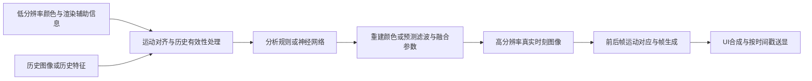
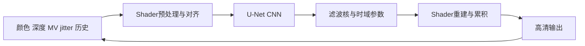

# NVIDIA、AMD、Arm、高通、华为、苹果：超分与插帧的神经网络技术深度调研

调研截止：**2026-09-07**。面向 GPU、图形算法与神经网络工程人员。重点是实时游戏渲染；自然图像超分、视频插值论文用于解释技术，单独标明与商用产品的关系。

**核心结论：六家都已有神经超分相关产品或公开能力，但不能把它们统一归为 Transformer。NVIDIA 明确披露了 DLSS 超分从 CNN 到 Transformer 的演进；Arm 的 NSS/NFRU 提供可直接阅读的 CNN 实现；AMD、高通、华为、苹果的部分商用神经能力已经确认，但所查官方资料不足以确定完整网络骨干。** 以下按功能和代际给出证据。

全文使用企业官网、企业官方代码/模型库、原始论文。链接紧邻结论，可直接打开；“未披露”指本次检索未取得足以确认的公开证据，不表示企业没有相应技术。产品宣传中的画质、能耗和帧率收益不视为跨厂商实测排名。

## 阅读导航

- [六家技术对照](#vendor-matrix)
- [超分、插值、外推与神经网络的关系](#fundamentals)
- [NVIDIA：CNN → Transformer 与多帧生成](#nvidia)
- [AMD：分析式 FSR → ML 超分和插帧](#amd)
- [Arm：可读源码的 CNN 超分和插帧](#arm)
- [高通：SGSR、AFME 与 Neural Fusion](#qualcomm)
- [华为：XEngine AI 超分与 AI 超帧](#huawei)
- [苹果：MetalFX 与公开研究](#apple)
- [CNN 与 Transformer 的工程比较](#architecture)
- [论文与源码阅读路线](#papers)
- [证据缺口与后续验证](#limits)

## 1. 六家技术对照

| 公司 | 超分如何做 | 插帧如何做 | CNN / Transformer 的证据边界 |
| --- | --- | --- | --- |
| NVIDIA | DLSS 2：时域反馈 + 卷积自编码器；DLSS 4/4.5 SR：视觉 Transformer / 第二代 Transformer | DLSS 3：光流与引擎运动信息 + CNN；DLSS 4/4.5：更新 AI 模型、共享计算、多帧生成与送显控制 | SR 的 Transformer **明确**；初代 DLSS 3 FG 的 CNN **明确**；不能将新版 FG 一概标为 Transformer。[官方 DLSS 入口](https://developer.nvidia.com/rtx/dlss) |
| AMD | FSR 1 空间滤波；FSR 2/3 分析式时域重建；FSR 4/4.1 改为 ML 时域超分 | FSR 3 分析式插值；Redstone ML FG 学习每像素运动/外观并结合重投影 | ML SR/FG **明确**，商用骨干的 CNN/Transformer 分类本轮未获官方证实。[Redstone 技术说明](https://gpuopen.com/learn/amd-fsr-redstone-developers-neural-rendering/) |
| Arm | ASR 为非神经时域算法；NSS 用 CNN 预测重建核及时间融合参数 | NFRU 用引擎 MV、光流与 CNN，对运动补偿候选学习融合 | 公开 NSS、NFRU 源码均为 **CNN**，不含可据以称为 Transformer 的注意力骨干。[官方模型库](https://github.com/arm/neural-graphics-model-gym) |
| 高通 | SGSR 1/2 为 shader 空间/时域路线；2026 Neural Fusion 明确 AI SR | 旧 AFME 示例为未来帧外推；Neural Fusion 宣布统一 AI SR 与 FG | 神经产品 **明确**；Neural Fusion 完整骨干未披露，不能拿研究 CNN 代替量产结构。[2026-09-02 官宣](https://www.qualcomm.com/news/onq/2026/09/adreno-neural-fusion-ai-rendering) |
| 华为 | XEngine 区分空域 GPU、空域 AI、时域 AI 超分 | Graphics Accelerate 提供内插/外插；2026 文档明确 AI 超帧 Vulkan 接口 | AI 能力 **明确**；具体 CNN/Transformer 未披露。[XEngine 官网](https://developer.huawei.com/consumer/cn/sdk/xengine-kit/?ha_source=202410yk&ha_sourceId=89000503)、[AI 超帧文档](https://developer.huawei.com/consumer/cn/doc/doccenter-capabilities/graphics-accelerate-fg-ai-vulkan) |
| 苹果 | MetalFX 分为空间与时域；时域 ML 超分及新版神经硬件协作已确认 | MetalFX Frame Interpolation 用两帧、深度、运动矢量生成中间帧 | ML 超分 **明确**；商用 SR 骨干、FI 是否使用特定网络均未由所查资料明确。[WWDC25 技术讲解](https://developer.apple.com/videos/play/wwdc2025/211/)、[当前 Metal 更新](https://developer.apple.com/metal/whats-new/) |

### 2026 年资料带来的重要修正

- **DLSS 4.5** 已有第二代 SR Transformer 与 Dynamic/6X Multi Frame Generation。6X 是最多一张真实渲染帧加五张生成帧，不是游戏逻辑执行速度提升六倍。[NVIDIA 当前技术说明](https://developer.nvidia.com/rtx/dlss)
- **AMD FSR SDK 2.3** 中，SR 是 4.1.1、ML FG 是 4.0.1；SR 正式覆盖 RX 7000/RDNA 3 与 RX 9000/RDNA 4，而 ML FG 本次仍针对 RDNA 4。不能再把早期 FSR 4 的硬件限制写成当前全局限制。[GPUOpen，2026-06-24](https://gpuopen.com/learn/amd-fsr-sdk-2-3-blog/)
- **Arm NFRU** 已出现在公开 SDK 和训练工具中，不能仅列为未来计划。[SDK v1.1.0](https://github.com/arm/neural-graphics-sdk-for-game-engines/releases/tag/v1.1.0)、[Model Gym v0.4.0](https://github.com/arm/neural-graphics-model-gym/releases/tag/v0.4.0)
- **高通 Neural Fusion** 是 2026-09-02 的新公告。该公告同时谈到软件商业支持和下一代旗舰 GPU 硬件，二者不等于“所有现售骁龙手机都已具备”。[Qualcomm 原文](https://www.qualcomm.com/news/onq/2026/09/adreno-neural-fusion-ai-rendering)

## 2. 超分、插值、外推与神经网络的关系

### 2.1 先区分解决的问题

| 问题 | 要重建什么 | 所需信息的典型形态 | 不能混淆的概念 |
| --- | --- | --- | --- |
| 空间超分 | 同一时刻的高分辨率像素 | 当前低分辨率图像 | 降低渲染量使 FPS 上升，不等于生成了新时间点的帧 |
| 时域超分 | 当前高分辨率图像，并抑制锯齿/闪烁 | 当前采样、历史、运动、深度、jitter | “时域”不等于“神经网络”；FSR 2 是反例 |
| 帧插值 | 两个已知时刻之间的图像 | 前后帧、运动对应、可见性 | 需后一个真实帧的信息，送显顺序和延迟必须重新安排 |
| 帧外推 | 当前时刻之后的预测图像 | 当前与过去帧、运动/相机信息 | 无法观察未来新暴露区域；预测错误不能靠未来真值现场修正 |
| 联合去噪超分 | 稀疏/带噪光追采样的完整高分辨率图像 | radiance、法线、材质、历史等 | 不是帧插值；Ray Reconstruction/Regeneration 应单独看 |

时域重建的基础是**历史采样累积与历史有效性判断**，这并不天然要求神经网络。参见 NVIDIA 研究员的 [A Survey of Temporal Antialiasing Techniques，Computer Graphics Forum 2020](https://research.nvidia.com/labs/rtr/publication/yang2020survey/)。内插和外插的产品接口差异可对照 [Apple WWDC25](https://developer.apple.com/videos/play/wwdc2025/211/) 与 [华为外插模式说明](https://developer.huawei.com/consumer/cn/doc/harmonyos-guides-V5/graphics-accelerate-fg-extrapolation-overview-V5)。

### 2.2 神经网络到底替换哪一步

以下是对公开实现的抽象归纳，并非六家完全相同的执行图：

神经网络可以直接预测 RGB，也可以只预测光流、遮挡 mask、滤波核或融合权重。**只输出几个参数的 CNN 仍然是真正的神经渲染**。Arm NSS/NFRU 正好说明，显式几何重投影与小网络可以协同工作，不需要网络独立“想象”整幅图像。[NSS 架构说明](https://developer.arm.com/community/arm-community-blogs/b/mobile-graphics-and-gaming-blog/posts/how-arm-neural-super-sampling-works)、[NFRU 后处理源码](https://github.com/arm/neural-graphics-model-gym/blob/4d47b991470443f82e363fc41b9c897513bdbc8d/src/ng_model_gym/usecases/nfru/model/torch_processing/postprocess.py)

## 3. NVIDIA：从 CNN 时域反馈到 Transformer 重建

### 3.1 DLSS 2：官方明确的卷积自编码器

2020 年官方说明直接使用 **convolutional autoencoder**。当前低分辨率有锯齿图像与引擎运动矢量用于结合上一帧的高分辨率输出；历史输出经运动对齐形成 temporal feedback，网络逐像素判断当前图像怎样重建。

可将其理解为：`当前低清图 + 对齐后的历史高清图 → CNN 重建 → 当前高清图 → 下帧历史`。因此它不同于只输入一张图片的普通单图 CNN 超分。DLSS 2 还改为跨游戏通用模型；训练时使用离线高质量 16K 参考图，训练后通过 NGX/驱动分发，在 RTX Tensor Cores 上推理。[NVIDIA：DLSS 2.0，2020-03-23](https://www.nvidia.com/en-gb/geforce/news/nvidia-dlss-2-0-a-big-leap-in-ai-rendering/)

**公开边界：**官方示意图和网络类别已知，但完整逐层结构、绝对参数量、训练数据与损失配方没有由这篇资料公开。不能声称已经掌握可训练复现的 DLSS 2 网络。

### 3.2 DLSS 3：插帧是另一张 CNN，不是调用超分网络两次

2022 年发布资料明确：两个连续超分帧、引擎运动矢量和光流信息送入 **CNN**，生成中间帧。Ada Optical Flow Accelerator 计算图像运动，Tensor Cores 执行网络；SR 与 FG 是不同模型。[NVIDIA DLSS 3 发布，2022-09-20](https://nvidianews.nvidia.com/news/nvidia-introduces-dlss-3-with-breakthrough-ai-powered-frame-generation-for-up-to-4x-performance)、[RTX 40 官方技术问答](https://www.nvidia.com/en-gb/geforce/news/rtx-40-series-community-qa/)

引擎运动矢量携带已知几何运动，图像光流则能补充粒子、反射等不一定被几何运动描述好的变化。网络的任务包含决定这些线索如何组合，而不只是让两张图做线性淡入淡出。完整 CNN 结构仍不公开，也没有证据表明它就是 Super SloMo 或 RIFE。

### 3.3 DLSS 4/4.5：Transformer 的明确范围是 SR、RR、DLAA

DLSS 4 的官方说明将视觉 Transformer 升级明确关联到 **Super Resolution、Ray Reconstruction、DLAA**。通过 self-attention 学习图像区域及时间信息的关系，改善细节稳定性；但它没有公开足以复现的层数、head 数、window 大小和完整训练代码。[DLSS 4 官方发布，2025-01](https://www.nvidia.com/en-us/geforce/news/dlss4-multi-frame-generation-ai-innovations/)

DLSS 4.5 的 **第二代 SR Transformer** 扩大计算与训练投入；官方说明强调线性空间训练/推理，以保留 HDR 光照信息。它不是“给传统放大器后面接一个聊天大模型”，而是专门的图像重建网络。[NVIDIA 4.5 技术博客，2026](https://developer.nvidia.com/blog/nvidia-dlss-4-5-delivers-super-resolution-upgrades-and-new-dynamic-multi-frame-generation/)、[4.5 原始发布说明](https://www.nvidia.com/en-us/geforce/news/dlss-4-5-dynamic-multi-frame-gen-6x-2nd-gen-transformer-super-res/)

### 3.4 多帧生成：复用神经计算，加上显示系统控制

DLSS 4 的研究说明给出两个重要机制：较大的神经计算对一对输入帧只执行一次并复用，较小的部分按每张生成帧执行；AI 光流替代原先依赖的硬件光流路径。Blackwell 的 hardware flip metering 负责更稳定的送显时序。[NVIDIA ADLR：DLSS 4 技术解析，2025，§2.2 与 §6](https://research.nvidia.com/labs/adlr/DLSS4/)

这解释了多帧生成为什么不必简单付出“插一帧网络成本 × 帧数”。工程难题同时包括 UI、遮挡、复杂运动和 pacing。当前 4.5 的 Dynamic MFG 动态调整倍率，6X 最多生成五张附加帧。[NVIDIA 当前开发者说明](https://developer.nvidia.com/rtx/dlss)

**必须保留的边界：**旧 DLSS 3 FG 的 CNN 有明确证据；新版 FG/MFG 的 AI 有明确证据；“DLSS 4.5 的 FG 本身采用第二代 Transformer”不能仅由 SR 的宣传文字推导出来。

### 3.5 DLSS 5：生成式神经渲染是另一个维度

2026-09-01 的 NVIDIA 研究页面将 DLSS 5 描述为 **单步像素空间 diffusion**，使用渲染画面、运动矢量和时间状态等条件改善外观、光照与材质。它应作为生成式渲染扩展理解，不能把 diffusion 骨干回填成 DLSS 4.5 SR 或 FG 的实现。[NVIDIA ADLR：DLSS 5](https://research.nvidia.com/labs/adlr/DLSS5/)

本节依据可读的官方研究摘要；未取得该页面链接论文的完整可读正文，因此不进一步推断 diffusion 内部层级。

## 4. AMD：分析式算法与 ML 算法并存

### 4.1 FSR 1/2/3：先有非神经路线

FSR 1 的 EASU 做空间边缘重建，RCAS 做锐化；只使用当前帧。FSR 2 使用 color、depth、motion vectors 和历史，实现时域重建与抗锯齿，官网明确“不使用机器学习”。[FSR 1 官网](https://gpuopen.com/fidelityfx-superresolution/)、[FSR 2 官网](https://gpuopen.com/fidelityfx-superresolution-2/)

FSR 3 原来的帧生成属于分析式插值，不能因为名字含 FSR 就把它归为神经网络。FSR 3.1 将超分与 FG 解耦，因此插帧模块可以与不同超分路径组合。[AMD FSR 3.1 发布与集成讲义，2024](https://gpuopen.com/download/FidelityFX_Super_Resolution_3-1_Release-Overview_and_Integration.pdf)

### 4.2 FSR 4/4.1：ML 超分已确认，但不能凭品牌猜骨干

当前 ML SR 文档要求抖动后的颜色/深度、运动矢量、曝光等信息；运动矢量用于建立当前与历史的对应，一般不应把 jitter 混入其中。FSR 4 不再强制游戏提供原先那样的 reactive mask 和 transparency/composition mask。[AMD 官方 ML SR 集成文档](https://github.com/GPUOpen-LibrariesAndSDKs/FidelityFX-SDK/blob/main/Kits/FidelityFX/docs/techniques/super-resolution-ml.md)

截至本次核查，官方 SDK 2.3 对应 ML SR 4.1.1，可用于 RX 7000 与 RX 9000 系列独显。SDK 总版本、SR 版本、FG 版本必须分别记录。[GPUOpen SDK 2.3，2026-06-24](https://gpuopen.com/learn/amd-fsr-sdk-2-3-blog/)

**能确认：神经网络参与时域图像重建。不能确认：完整骨干一定是 CNN、U-Net 或 Transformer。** 本报告未使用泄露代码或仅凭媒体形容来填补该缺口。官方仓库提供 SDK、样例和有限源码，并不等于完整 ML 网络及训练管线全部开源。

### 4.3 Redstone ML FG：学习运动和外观，再结合重投影

2025-12 的官方解释给出：输入前后两个真实渲染帧、深度与引擎运动矢量；利用光流和运动矢量理解运动，ML 网络预测每像素运动与外观，并结合 MV reprojection 生成中间帧。这是实际的神经帧生成，不是给旧分析算法换名称。[AMD Redstone 技术说明，2025-12-10](https://gpuopen.com/learn/amd-fsr-redstone-developers-neural-rendering/)

当前官方 FG 页面说明模型在 AMD Instinct 上训练，运行端针对 RDNA 4；旧分析式路径仍作为兼容回退。配合 Anti-Lag 2 可以管理延迟，但生成帧仍不能增加游戏真实模拟/输入采样频率。[AMD FSR Frame Generation](https://gpuopen.com/amd-fsr-framegeneration/)

公开到的是**数据流与功能**，不是完整 CNN/Transformer 结构。ML FG 4.0.1 也不能因 SR 4.1.1 支持 RDNA 3，就自动宣称具有相同硬件范围。[官方 ML FG 文档](https://github.com/GPUOpen-LibrariesAndSDKs/FidelityFX-SDK/blob/main/Kits/FidelityFX/docs/techniques/frame-interpolation-ml.md)

### 4.4 AMD 可深入研究的 CNN：NSSD

AMD 的 **Neural Supersampling and Denoising** 研究明确使用多分支、多尺度 U-Net：将有噪 radiance 与无噪但有锯齿的 guide buffers 分开提取特征；较小的引导分支利用法线、材质、深度等信息，网络预测重建/滤波相关权重，联合处理去噪和超分。[GPUOpen 技术长文，2024-10-28，更新 2025-06-26](https://gpuopen.com/learn/neural_supersampling_and_denoising_for_real-time_path_tracing/)

对应论文为 **Joint Denoising and Upscaling via Multi-branch and Multi-scale Feature Network**，I3D 2025。这里能学习“CNN 怎样联合利用渲染辅助信息”，但**没有证据证明 NSSD 就是商用 FSR 4/4.1 网络**。论文与产品的同一性不能由公司作者身份推出。

## 5. Arm：最适合从公开源码理解移动神经超分与插帧

### 5.1 ASR 与 NSS 不是同一算法

ASR 从 FSR 2 v2.2.2 派生，对移动 GPU 的 shader 和带宽成本进行优化，属于非神经时域超分。NSS 则引入学习模型，不应将“Arm 超分”一律称为 AI。[Arm ASR 官方介绍，2024](https://developer.arm.com/community/arm-community-blogs/b/mobile-graphics-and-gaming-blog/posts/introducing-arm-accuracy-super-resolution)、[ASR 官方实现](https://github.com/arm/accuracy-super-resolution-generic-library)

### 5.2 NSS：CNN 学习重建参数，shader 执行重建

Arm 2025 年技术说明的 NSS 采用四级 U-Net，具有跨尺度跳连和时间反馈。预处理组织颜色、深度、MV、亮度变化和新暴露区域信息，并重投影历史特征；网络预测滤波与历史融合参数；后处理再生成高清颜色。这样可以将网络容量集中在“何时相信历史、怎样滤波”的决策上。[Arm NSS 架构、训练与推理，2025-08-12](https://developer.arm.com/community/arm-community-blogs/b/mobile-graphics-and-gaming-blog/posts/how-arm-neural-super-sampling-works)

2025 说明还给出训练对：540p、1 spp 输入与 1080p、16 spp 真值，采用序列递归训练及同时关注空间误差和时间稳定性的损失。训练目标因此比“单张截图更锐利”更完整。[同一官方训练说明](https://developer.arm.com/community/arm-community-blogs/b/mobile-graphics-and-gaming-blog/posts/how-arm-neural-super-sampling-works)

### 5.3 2026 源码核验：确实是 CNN，核尺寸已有版本变化

本次固定阅读提交 `4d47b991470443f82e363fc41b9c897513bdbc8d`，避免未来主分支变化：

- `AutoEncoderV1` 使用 3×3 卷积、ReLU、stride-2 下采样、nearest 上采样和 concat 跳连。
- 输出分别为 KPN 参数和 temporal 参数。代码构造函数默认 `kpn_size=(6,6)`，并提供核裁剪功能。
- 这与 2025 博客中的 4×4 核不同，属于需按版本记录的实现变化，不能把 4×4 当成当前所有模型的固定常数。

直接阅读：[NSS AutoEncoderV1 固定版本源码](https://github.com/arm/neural-graphics-model-gym/blob/4d47b991470443f82e363fc41b9c897513bdbc8d/src/ng_model_gym/usecases/nss/model/model_blocks_v1.py)。这份代码可确认 CNN 骨干；不能因为其中有逐像素权重，就把它称作 Transformer attention。

### 5.4 NFRU：CNN 判断四路候选该相信哪一路

公开 NFRU 使用引擎 MV、光流对应和神经网络，在两张真实帧之间生成一张中间帧。SDK 有 Android AArch64 及桌面验证路径。[Arm Neural Graphics SDK](https://github.com/arm/neural-graphics-sdk-for-game-engines)

源码中 `NFRUAutoEncoder` 为轻量多分支 CNN，使用 1×1、3×3、5×5、7×7 卷积、激活、下采样、nearest 上采样和跳连，输出四通道参数。后处理构造四个候选：

1. 用引擎 MV 对前帧重采样。
2. 用引擎 MV 对后帧重采样。
3. 用 optical flow 对前帧重采样。
4. 用 optical flow 对后帧重采样。

网络参数上采样后经 softmax 形成四个权重，对四个 RGB 候选加权。这是“几何/光流负责搬像素，CNN 学习可信度”的明确实例。[NFRU CNN 源码](https://github.com/arm/neural-graphics-model-gym/blob/4d47b991470443f82e363fc41b9c897513bdbc8d/src/ng_model_gym/usecases/nfru/model/nfru_v1_nn.py)、[四路 warp 与 softmax 融合源码](https://github.com/arm/neural-graphics-model-gym/blob/4d47b991470443f82e363fc41b9c897513bdbc8d/src/ng_model_gym/usecases/nfru/model/torch_processing/postprocess.py)

概念式为 `输出 = Σ softmax(网络输出)i × 第 i 路运动补偿图像`。这里的 softmax 是候选融合，不是 Q/K/V 自注意力；**存在 softmax 不等于模型是 Transformer**。

### 5.5 开放与部署边界

Model Gym 提供训练、微调、量化感知训练和导出示例；运行端 SDK 采用 Vulkan，可通过 `VK_ARM_tensors`、`VK_ARM_data_graph` 或仿真层执行。原生神经加速位于 GPU 路线，不应直接写为独立 NPU 推理。[训练工具与示例](https://github.com/arm/neural-graphics-model-gym-examples)、[SDK 平台与扩展要求](https://github.com/arm/neural-graphics-sdk-for-game-engines)

SDK 开源、桌面仿真能跑，与某一手机已经原生高效支持是不同事实。Arm 的 2026 生态更新仍需结合具体 GPU、驱动和终端判断。[Arm 生态更新，2026-08-04](https://newsroom.arm.com/blog/arm-neural-technology-mobile-gaming-ecosystem)

## 6. 高通：传统 shader、外推与新神经图形路线

### 6.1 SGSR 1/2：不是所有“超分”都做神经推理

SGSR 1 是单 pass 空间超分，针对移动渲染的采样与 ALU 成本优化。SGSR 2 改为 TAAU：使用颜色、深度、运动矢量和历史，convert pass 处理运动/深度相关信息，upscale pass 用优化的 Lanczos 重建，另可锐化。这两代公开实现属于 shader 路线。[SGSR 1 官方介绍，2023-04](https://www.qualcomm.com/news/onq/2023/04/introducing-snapdragon-game-super-resolution)、[SGSR 2 官方技术说明，2024-10](https://www.qualcomm.com/developer/blog/2024/10/introducing-snapdragon-game-super-resolution-2)、[官方源代码](https://github.com/SnapdragonGameStudios/snapdragon-gsr)

即使通过降低分辨率把真实渲染帧率提高，也不能据此称 SGSR 本身为插帧算法。

### 6.2 AFME：旧公开示例明确是外推

官方 OpenGL ES 样例先渲染两张真实帧，然后交替真实渲染与外推，通过 `glExtrapolateTex2DQCOM` 根据最近两张真实颜色纹理预测未来时刻。样例不要求引擎提供与 NFRU 相同的一组 MV/depth 资源。[Adaptive Frame Motion Extrapolation Power Saving 官方样例](https://github.com/SnapdragonGameStudios/adreno-gpu-opengl-es-code-sample-framework/tree/main/samples/amfe_power_saving)

它与“前后真帧夹住一个中间时刻”的双向插值不同。该示例也不能代表所有 AFME 后续版本：当前 Adreno 官网已出现 AI-powered Gaming FRC 描述，但未给出足以确定各代 CNN/Transformer 的结构资料。[Adreno 官方产品页](https://www.qualcomm.com/processors/adreno)

### 6.3 Adreno Neural Fusion：2026 年已确认的 AI SR + FG

2026-09-02 官方公告将 neural processing、AI super resolution 与 frame generation 放进统一图形管线；新 **Adreno Matrix Cores** 执行图形 AI，并搭配 **18 MB HPM**，让 tile、帧缓冲和中间计算更靠近 GPU，减少外部内存传输。[Qualcomm：Adreno Neural Fusion](https://www.qualcomm.com/news/onq/2026/09/adreno-neural-fusion-ai-rendering)

该公告说明 Unity/Unreal 支持和商业可用性，同时将新硬件描述为下一代旗舰平台能力。报告只能确认这一级披露，不能补写未公布的具体手机出货覆盖、网络层数或实机毫秒数。

**CNN/Transformer：未披露。** GPU 新增矩阵计算能力只能说明部署基础，不能证明模型一定是 Transformer；CNN 同样大量使用矩阵乘法。也不能自动把所有旧 AFME 模式视为 Neural Fusion 同一个模型。

### 6.4 高通已公开的 CNN 研究：高效递归超采样

ICCV 2023 的 **Efficient Neural Supersampling on a Novel Gaming Dataset** 由 Qualcomm AI Research 作者提出：显式处理深度感知运动矢量、jitter 和历史重投影；在低分辨率上做卷积，再用重排恢复高分辨率，预测颜色候选、融合 mask 和递归特征。首尾卷积还使用 jitter-conditioned kernel，已知 jitter 序列可预计算相关核。[原论文全文](https://arxiv.org/html/2308.01483v1)

其重要性在于降低高分辨率特征计算成本，并提供带渲染辅助信息的 QRISP 数据集。论文中的桌面 GPU/TensorRT 性能不能当作骁龙手机实测，更没有证据证明该 CNN 已原样进入 SGSR 2 或 Neural Fusion。[Qualcomm QRISP 数据集官网](https://www.qualcomm.com/developer/software/qualcomm-rasterized-images-dataset)

## 7. 华为：应落到 XEngine 与 Graphics Accelerate 的具体能力

### 7.1 XEngine 明确区分三种超分

官方页面列出空域 GPU 超分、空域 AI 超分与时域 AI 超分：前两者从单帧空间邻域取信息，AI 版本增加推理；时域 AI 版本融合历史和当前信息。官网同时说明针对 Maleoon GPU 及芯片进行优化，可调度 NPU 等 IP。[XEngine Kit 官方说明](https://developer.huawei.com/consumer/cn/sdk/xengine-kit/?ha_source=202410yk&ha_sourceId=89000503)

这支持“华为有游戏神经超分和异构协作能力”的判断，但不支持“所有环节都在 NPU”或“具体使用某款 Transformer”的判断。单一“方舟引擎”宣传名称不能代替这些 API 级证据。

### 7.2 时域 AI 超分：渲染辅助信息是真实接口要求

固定版本文档的 `XEG_TemporalUpscaleDescription` 包含 input、depth、motionVector、dynamicMask，以及 jitterX/Y、resetHistory 等字段。这说明其并不是照片超分接口直接套用到游戏，而是面向渲染历史与运动对应的集成。[华为 API 结构体，更新 2025-04-14](https://developer.huawei.com/consumer/cn/doc/harmonyos-references-V14/xengine-kit-xeg-temporalupscaledescription-V14)、[Vulkan 时域超分头文件参考](https://developer.huawei.com/consumer/cn/doc/harmonyos-references-V14/xengine-kit-xeg-vulkan-temporal-upscale-8h-V14)

固定 V14 文档是用于确认结构的版本证据，不代表当前系统能力的最高版本。最新版是否支持仍须按扩展枚举和设备查询确认。

### 7.3 AI 超帧：2026 文档已有可执行的接入路径

2026-07-28 的 AI 超帧 Vulkan 文档给出关键差异：查询 `HMS_FG_IsFrameGenerationSupported`，选择**内插模式与系统侧送显**，通过 `HMS_FG_Dispatch_VK` 传入真实帧颜色和相机矩阵。该路径要求**不要传深度**，否则触发另一种“增强超帧算法”。[华为 AI 超帧 Vulkan 开发文档](https://developer.huawei.com/consumer/cn/doc/doccenter-capabilities/graphics-accelerate-fg-ai-vulkan)

因此不能把普通增强超帧的参数集不加区分地写成 AI 超帧输入，也不能由“不传深度”推断内部光流模型一定是 CNN 或 Transformer。官方已经确认 AI 功能，骨干、参数量和推理调度尚缺公开证据。

旧版官方文档同时有外插模式：由 N−1/N 预测 N+0.5。所谓避免等待未来帧，不等于预测计算、同步、送显完全没有代价。[华为超帧外插模式概述](https://developer.huawei.com/consumer/cn/doc/harmonyos-guides-V5/graphics-accelerate-fg-extrapolation-overview-V5)

### 7.4 华为的 Transformer 研究证据：IPT，而非量产映射

**Pre-Trained Image Processing Transformer（IPT），CVPR 2021** 的作者来自 Huawei Noah’s Ark Lab、华为中央软件院及合作高校。它采用共享 Transformer 和任务相关 head/tail，以大规模退化图像对预训练，并面向超分、去噪、去雨微调。[CVPR 原论文](https://openaccess.thecvf.com/content/CVPR2021/papers/Chen_Pre-Trained_Image_Processing_Transformer_CVPR_2021_paper.pdf)、[arXiv 入口](https://arxiv.org/abs/2012.00364)、[华为 Noah 官方代码](https://github.com/huawei-noah/Pretrained-IPT)

这是华为开展 Transformer 超分研究的直接证据，**不是 XEngine 时域 AI 超分采用 IPT 的证据**。任务、输入、时序和实时预算都不同。

另一个值得阅读的高效网络方向是 **AdderSR，CVPR 2021**：用加法式特征匹配等设计降低超分网络的算术成本。它解释了神经超分可以针对能效改造，但不能将论文的算术收益等同某款麒麟手机整机节电比例。[AdderSR 原论文页面](https://openaccess.thecvf.com/content/CVPR2021/html/Song_AdderSR_Towards_Energy_Efficient_Image_Super-Resolution_CVPR_2021_paper.html)

### 7.5 华为相关 CNN 插帧论文：A²OF

**Video Interpolation by Event-driven Anisotropic Adjustment of Optical Flow（ECCV 2022）** 由华为与清华作者提出，结合 IFNet、事件驱动光流分配、CNN 细化与融合生成中间帧。事件流提供普通两帧图像之间缺失的运动线索。[ECVA 原论文 PDF](https://www.ecva.net/papers/eccv_2022/papers_ECCV/papers/136670261.pdf)

这是一条 CNN/光流研究证据，但额外依赖 event-camera 数据；它不是游戏引擎的运动矢量，也没有证据表明对应 Graphics Accelerate Kit AI 超帧。

## 8. 苹果：MetalFX 接口与网络公开程度要分开看

### 8.1 Spatial 与 Temporal 不是一个输入模型

MetalFX Spatial 只需当前颜色纹理；Temporal 结合颜色、深度和运动信息及历史采样。不能因为 temporal 是 ML，就把 spatial 也指定成同样的网络。[Apple MetalFX 框架文档](https://developer.apple.com/documentation/MetalFX)

Apple 在 WWDC25 明确说 MetalFX 的 ML upscaler 自 2022 年即已存在。当前 What's New 页面进一步说明，重新设计的 temporal upscaler 在 M5 Pro/Max 上同时利用 Neural Engine 与 Neural Accelerators，并支持动态分辨率等能力。[WWDC25：02:13 起](https://developer.apple.com/videos/play/wwdc2025/211/?time=133)、[Apple 当前 Metal 更新](https://developer.apple.com/metal/whats-new/)

**结论是神经超分明确、硬件协作明确；CNN/Transformer 骨干仍未公开。** 不能将 M5 Pro/Max 的描述推广成所有 Apple 芯片都采用同样的执行划分。

### 8.2 MetalFX Frame Interpolation：两帧与辅助缓冲生成中间帧

2025 新插帧接口接收前后颜色、深度、运动矢量，在两个真实时刻之间生成一帧；推荐位于 tone mapping 之后。对 UI 和送显节奏必须单独处理，不能把整个屏幕直接当普通视频交给插值器。[WWDC25 插帧章节：07:17 起](https://developer.apple.com/videos/play/wwdc2025/211/?time=437)

这段官方材料明确了 FI 的输入、集成和时序，**没有足够证据把 FI 本身归类为 CNN 或 Transformer**。同场演讲明确 ML 的 SR/denoising，不代表每一个 MetalFX 模块都使用同一神经网络。

### 8.3 联合去噪超分与插帧分属不同问题

MetalFX denoised upscaler 在普通时域输入之外增加法线、diffuse/specular albedo、roughness 等引导信息，联合去噪与超分。它与 DLSS RR、AMD NSSD/Ray Regeneration 更适合横向比较，而不是与单纯的帧插值混排。[WWDC25 去噪超分：19:25 起](https://developer.apple.com/videos/play/wwdc2025/211/?time=1165)

### 8.4 Apple 的公开 CNN 插帧研究

Apple Research 的 **Video Frame Interpolation via Structure-Motion based Iterative Feature Fusion**（2021）结合结构分支、运动分支和迭代特征融合：结构路径使用可变形卷积，运动路径使用 PWCNet 光流，再融合、细化中间帧。这是可读的 CNN/光流插帧研究。[Apple Research 论文页](https://machinelearning.apple.com/research/video-frame-interpolation)、[原论文 PDF](https://arxiv.org/pdf/2105.05353)

论文证明 Apple 研究过这种算法，**没有证明它就是 MetalFX Frame Interpolation 的商用实现**。普通视频没有引擎提供的深度、相机与几何运动信息，不能忽略两类任务的差异。

### 8.5 Apple 的 Transformer 视频研究：STIV

Apple Research 的 **STIV（官网 2025-08）** 明确使用 Diffusion Transformer（DiT），将图像条件注入视频生成模型，并说明可扩展至帧插值、视频预测等任务。[Apple STIV 官方论文入口](https://machinelearning.apple.com/research/conditioned-video-generation)

它说明 Apple 有 Transformer 视频生成研究，却不能证明 MetalFX 采用 DiT。STIV 的生成任务与实时游戏重建预算不同，本文不把它纳入商用 FI 性能比较。

## 9. CNN 与 Transformer：真正值得比较的工程问题

以下为基于前述公开架构的工程归纳，非厂商未公开实现的猜测。

### 9.1 CNN 不只是“低级方案”

CNN 可以承担特征提取、光流估计、历史可信度判断、滤波核预测、融合权重预测乃至最终 RGB 重建。U-Net 的下采样扩大感受范围，跳连保留空间细节；递归特征还能保留跨帧信息。Arm 的明确源码和 NVIDIA Super SloMo 都说明，**CNN 完全能够实现复杂的时空重建**。[Arm NSS 源码](https://github.com/arm/neural-graphics-model-gym/blob/4d47b991470443f82e363fc41b9c897513bdbc8d/src/ng_model_gym/usecases/nss/model/model_blocks_v1.py)、[NVIDIA Super SloMo](https://research.nvidia.com/publication/2018-06_super-slomo-high-quality-estimation-multiple-intermediate-frames-video)

### 9.2 Transformer 改变的是信息交互方式

Transformer 的关键是基于内容的注意力关联，而不是简单“参数更多”。在重建中，可比较不同位置、帧或特征之间的匹配关系；window/shifted-window 等设计限制开销。SwinIR 主要面向图像恢复，RSTT 则直接面向同时增加空间与时间分辨率。[SwinIR 原论文](https://arxiv.org/abs/2108.10257)、[RSTT 原论文](https://arxiv.org/abs/2203.14186)

这些论文可以解释技术，但不能据此认定 DLSS 使用 SwinIR/RSTT。厂商只披露“Transformer”，也不意味着采用全分辨率全局注意力或特定开源网络。

| 比较项 | CNN 路线典型关注 | Transformer 路线典型关注 | 对 GPU 设计/评估的意义 |
| --- | --- | --- | --- |
| 计算 | 卷积、激活、重排、上下采样 | 投影矩阵、attention、归一化、MLP；常混有卷积 | 测真实算子组合，而非只比峰值 TOPS |
| 时间信息 | 显式 warp、历史 RGB/隐藏特征、递归 | 时间特征关联、attention；仍可结合 warp | 两者都需要可靠历史管理，不能省略场景切换处理 |
| 高分辨率代价 | 特征图通道与卷积成本 | token/窗口规模与中间张量 | 关注带宽、片上存储、算子融合和张量布局 |
| 输出形式 | RGB、kernel、mask、flow、参数 | 同样可以输出图像或参数 | “是否生成 RGB”不能判断 CNN/Transformer |
| 量化 | 量化误差是否影响核、权重和时间稳定性 | 低精度矩阵及敏感算子处理 | 需在连续序列上测闪烁/拖影，不能只测单帧 PSNR |

表中工程判断建立在 [NVIDIA DLSS 4 优化讨论](https://research.nvidia.com/labs/adlr/DLSS4/)、[Arm QAT 示例](https://github.com/arm/neural-graphics-model-gym-examples) 和 [RSTT 架构](https://arxiv.org/html/2203.14186v1) 上；不是对闭源产品内部算子的一览表。

### 9.3 三种容易误判的情况

- **存在光流，不等于非神经网络。** 光流既能由分析式算法产生，也能由网络估计；后面的融合还可能另用网络。
- **存在 softmax，不等于 Transformer。** Arm NFRU 用 softmax 归一化四路融合权重，没有因此变成自注意力模型。
- **使用矩阵硬件，不等于独立 NPU。** NVIDIA Tensor Cores、Arm GPU 神经加速、Qualcomm Adreno Matrix Cores 都应按具体硬件位置理解；Apple/Huawei 则须按已披露的异构协作范围描述。

### 9.4 对移动 GPU 最有价值的设计启示

**工程推论：优先让渲染数据与神经推理高效协作，再决定扩大模型。** Arm 的参数预测、Qualcomm 研究的低分辨率卷积，以及 Neural Fusion 对片上中间数据的强调，都表明数据搬运是不能忽略的成本。一个高 TOPS 但需要反复转格式、跨处理器复制、同步等待的方案，未必比紧凑 CNN 更合适。

这不是根据公开资料就能确定的产品性能排名；需要实测渲染、预处理、推理、后处理、UI 与送显的完整路径。

## 10. 论文与源码阅读路线

### 10.1 优先阅读：与六家研究或产品直接相关

| 材料 | 类型与归属 | 建议重点看什么 | 与商用产品的关系 |
| --- | --- | --- | --- |
| [Super SloMo，CVPR 2018](https://research.nvidia.com/publication/2018-06_super-slomo-high-quality-estimation-multiple-intermediate-frames-video) | NVIDIA/高校原论文 | 两个 U-Net：双向光流、流细化、可见性、warp 融合 | CNN 插帧原理；不能称其为 DLSS FG 源码 |
| [DLSS 4: Transforming Real-Time Graphics with AI](https://research.nvidia.com/labs/adlr/DLSS4/) | NVIDIA 官方技术研究说明，2025 | Transformer 的工程优化、多帧共享计算、pacing | 直接产品技术资料；不等于全网络公开 |
| [Neural Supersampling and Denoising](https://gpuopen.com/learn/neural_supersampling_and_denoising_for_real-time_path_tracing/) | AMD 研究说明，对应 I3D 2025 论文 | 多分支 U-Net、guide buffers、联合去噪超分 | 研究可读；FSR 4 内部映射未证实 |
| [Arm NSS 架构长文](https://developer.arm.com/community/arm-community-blogs/b/mobile-graphics-and-gaming-blog/posts/how-arm-neural-super-sampling-works) | Arm 官方技术说明，2025 | 参数预测、历史反馈、训练对、QAT | 有产品路线关联；参数需与代码版本对齐 |
| [Arm Model Gym](https://github.com/arm/neural-graphics-model-gym) | Arm 官方训练代码，2026 核验 | NSS/NFRU 模型与可微前后处理 | 当前最适合直接跟踪 CNN 数据流的材料之一 |
| [Efficient Neural Supersampling on a Novel Gaming Dataset](https://arxiv.org/abs/2308.01483) | Qualcomm AI Research，ICCV 2023 | jitter 条件卷积、递归、低分辨率计算、QRISP | 没有证据等于 SGSR/Neural Fusion |
| [IPT](https://arxiv.org/abs/2012.00364) | Huawei/高校，CVPR 2021 | 图像 Transformer 预训练、多任务 head/tail | 不等于 XEngine 商用骨干 |
| [AdderSR](https://openaccess.thecvf.com/content/CVPR2021/html/Song_AdderSR_Towards_Energy_Efficient_Image_Super-Resolution_CVPR_2021_paper.html) | Huawei 相关高效超分研究，CVPR 2021 | 神经超分的算术能效改造 | 不等于某手机游戏模式的实测实现 |
| [Structure-Motion Iterative Feature Fusion](https://machinelearning.apple.com/research/video-frame-interpolation) | Apple/高校视频插帧研究，2021 | 可变形卷积与光流的互补 | 未证实是 MetalFX FI |

### 10.2 Transformer 与实时性的补充论文

| 原始论文 | 能回答的问题 | 使用限制 |
| --- | --- | --- |
| [SwinIR，ICCV Workshops 2021](https://arxiv.org/abs/2108.10257) | 残差 Swin Transformer 怎样用于单图超分与恢复 | 不是游戏时域超分或插帧完整方案 |
| [Swin2SR，ECCV Workshops 2022](https://arxiv.org/abs/2209.11345) | SwinV2 如何改善超分、压缩图像恢复及训练 | 不是帧生成；不能自动转化为实时移动部署 |
| [RSTT，CVPR 2022](https://arxiv.org/abs/2203.14186) | 时空 Transformer 怎样用共享编码和查询同时提高分辨率/帧率 | 作者为 UT Austin/Microsoft；不是六家产品实现。论文“real-time”的分辨率与硬件需单独核对 |
| [RIFE，ECCV 2022 研究](https://arxiv.org/abs/2011.06294) | IFNet 怎样直接估计中间流、利用蒸馏提高效率 | 普通视频插值基线，不是 DLSS/MetalFX/华为超帧源码 |

建议顺序：**先看 FSR 2/ASR 的非神经基线 → Arm NSS/NFRU 源码 → NVIDIA 产品演进 → Qualcomm 渲染数据研究 → RSTT/SwinIR 的 Transformer 机制**。这样能分清网络到底取代了哪一段算法，而不是只按品牌名分类。

## 11. 证据缺口与后续验证

### 11.1 哪些仍不能下结论

| 缺口 | 本次可确认 | 仍需企业追加披露或实验 |
| --- | --- | --- |
| AMD / Qualcomm / Huawei / Apple 商用骨干 | 所列 AI/ML 超分能力已经有官方证据 | CNN/Transformer 细分、层数、参数、完整训练策略 |
| NVIDIA 新版 FG 骨干 | AI 光流、多帧共享计算；旧 DLSS 3 FG 为 CNN | 不能把新版 SR Transformer 标签直接扩展到 FG |
| 闭源模型复现 | 可按 SDK 做功能集成 | SDK 存在不意味着权重/训练源码全部开放 |
| 移动实机成本 | Arm/Qualcomm 有算法及硬件路线资料 | 同分辨率、同真实 FPS、同画质下的持续功耗、带宽和延迟 |
| 论文到产品映射 | 企业作者与研究能力可以核实 | 需直接产品说明，不能靠作者单位建立等同关系 |

### 11.2 如何做可信的下一阶段比较

以下是建议的实验设计，不是本次已完成的实测：

1. 记录真实渲染 FPS、生成帧 FPS、输入到显示延迟、P95/P99 帧间隔；不要只看最终 FPS。
2. 固定输入/输出分辨率、jitter、相机路径、MV、深度约定、HDR/exposure、UI 合成方式；标清各方案必须/可选的输入。
3. 使用粒子、透明物、反射、细线、快速横移、遮挡揭露、镜头切换、动态分辨率变化等序列，检查连续播放中的闪烁和拖影。
4. 分解渲染、预处理、网络、后处理、同步与送显成本，报告持续运行的功耗/温度；桌面论文毫秒数不能直接移植为手机结论。
5. 以 FSR 2/ASR/SGSR 2、Arm NSS/NFRU 和一个研究 Transformer 为独立对照，分别测“去掉 NN”“减少历史”“去掉 MV/光流”的影响，避免把多项变化混在同一比较中。

### 11.3 检索与可访问性说明

本次先按六家公司分别查官方产品与版本，再追踪 API、模型源码和作者论文，最后核对会改变结论的新版本及容易误归类的网络结构。关键结论已由协调核查再次检查；未公开内容保留缺口，未用二手推测补齐。

部分华为动态文档直接抓取会超时或只返回页面框架，相关结论使用同一官方页面被索引的正文，并保留原始官方链接。两篇 Arm 技术博客对脚本直连返回 403，但研究检索工具可读取官方正文。部分 CVF 论文直连受访问限制，同时提供 arXiv 原文入口。外部网站后续访问仍可能需要浏览器、地区网络或登录；本报告没有把这些情况误报为论文不存在。

本文为 Markdown 技术调研，已做结构与链接目标检查；没有进行六家产品实机画质/性能测试。配套实验选题可参阅本目录的[移动 GPU 实时超分与插帧实验调研](mobile-gpu-super-resolution-frame-generation.md)。
